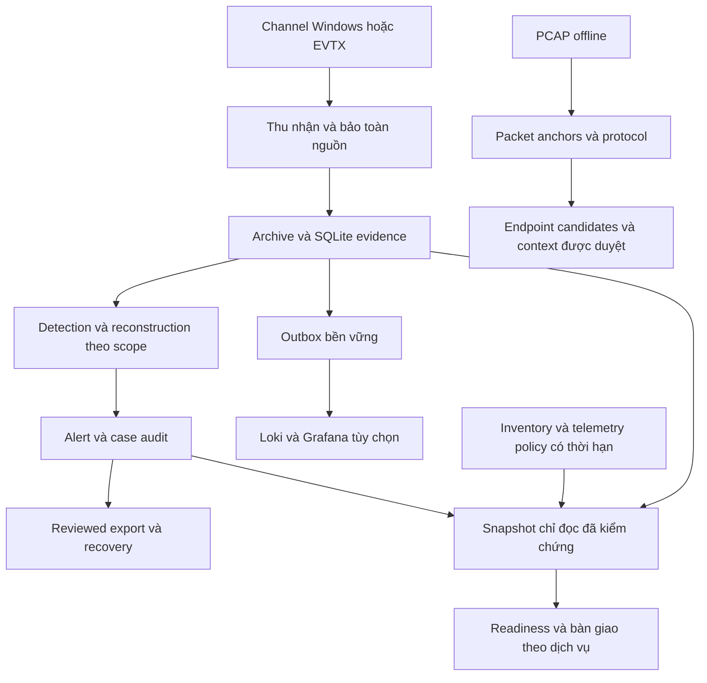
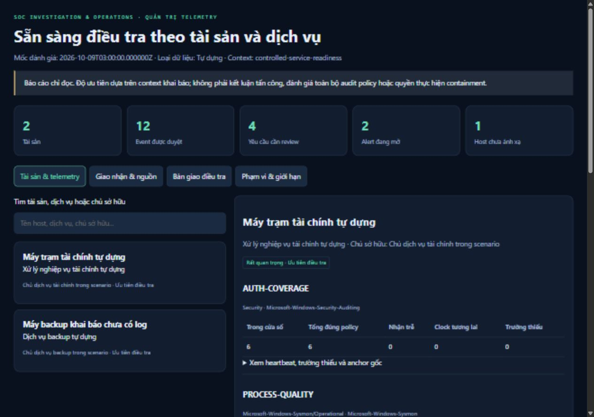

# SOC Investigation & Operations

Tôi xây dựng dự án này để xử lý trọn một luồng điều tra SOC: thu nhận dữ liệu, bảo toàn nguồn gốc, phát hiện dấu hiệu, kiểm tra giả thuyết, ghi nhận quyết định và bàn giao có căn cứ. Windows telemetry, packet capture và context dịch vụ trả lời những câu hỏi khác nhau; hệ thống giữ các ranh giới đó khi tương quan và báo cáo.

**Phiên bản 6.0.0 — hoàn thiện ngày 09/10/2026.** Core dùng Python standard library, SQLite và PowerShell; Loki/Grafana native là backend tùy chọn. Tôi chọn phạm vi một workstation để triển khai trên máy 8 GB RAM mà không cần Docker hoặc VM.

[Báo cáo dự án đầy đủ](docs/PROJECT_REPORT_VI.md) · [Kiến trúc](docs/ARCHITECTURE.md) · [Vận hành](docs/OPERATIONS.md) · [Nghiệm thu](docs/ACCEPTANCE.md) · [Thiết kế v6](docs/ENGINEERING_V6.md)

## Bài toán tôi giải quyết

Alert có thể đúng về biểu thức nhưng chưa đủ về điều tra. Một lệnh tạo task chưa chứng minh task đã chạy. Log đăng nhập thất bại chưa chứng minh truy cập thành công. Cùng IP và gần thời gian chưa xác định được process. Ngoài ra, một tài sản không có alert có thể đang thiếu dữ liệu.

Tôi thiết kế hệ thống để người điều tra kiểm tra lại từng bước: bản ghi đến từ đâu, quan hệ nào được quan sát, dữ liệu nào còn thiếu, ai đã quyết định điều gì và trạng thái nào cần khôi phục sau lỗi. v6 bổ sung đánh giá theo tài sản/dịch vụ, chất lượng telemetry và biên bản bàn giao, sử dụng snapshot chỉ đọc với tập nguồn được duyệt rõ ràng.

## Thành phần đã triển khai

| Nhóm | Chức năng | Căn cứ trong repo |
| --- | --- | --- |
| Thu nhận | EVTX export giữ XML; polling channel hiện hữu; cursor, fingerprint và gap/reset diagnostic | [Collector](soclab/collector.py), [native proof dạng tổng hợp](evidence/live/private-collection-proof.json) |
| Bằng chứng | Hash byte nguồn, physical line, UID, original object, UTC timeline; import có transaction | [Schema](docs/DATA_SCHEMA.md), [validation lịch sử](evidence/portfolio-validation.json) |
| Phát hiện | Chín Windows event rule, ba giả thuyết authentication offline, một chuỗi đa bước | [Policy](rules/windows.json), [evaluation](evidence/advanced/evaluation.json) |
| Điều tra | Host/domain/session/process GUID, ancestry quan sát, link thiếu/xung đột, exact source scope | [Case 005](cases/005-multisource-chain/report.md) |
| Hunting/PowerShell | Tám SQL hunt; fragment completeness/conflict; bounded decode; native AST chỉ parse | [Hunts](evidence/operations/hunts.json), [forensics](docs/POWERSHELL_FORENSICS.md) |
| Giao nhận | Durable outbox, persisted payload/time, lease, retry/backoff, dead letter, explicit redrive | [Actual Loki recovery lịch sử](evidence/network/ci-live-responses.json) |
| Workflow analyst | Owner, revision, rationale, trạng thái, verdict, audit chain, case linkage, reviewed export | [Workflow](docs/ENGINEERING_V3.md), [browser proof](evidence/live/browser-validation.json) |
| Packet | PCAP anchors, TCP reassembly, DNS association, HTTP framing/body hash, TLS SNI | [Case 006](cases/006-public-network/report.md), [Case 007](cases/007-network-context/report.md) |
| Context dịch vụ v6 | Inventory/host alias, chủ dịch vụ, criticality, exact sources và thời hạn context | [Thiết kế v6](docs/ENGINEERING_V6.md), [profile tự dựng](evidence/service/context.json) |
| Quality v6 | Provider/channel/Event ID, required fields, activity freshness, ingest lag, clock, heartbeat theo scope | [Case 008](cases/008-telemetry-readiness/report.md), [kết quả](evidence/service/report/readiness.json) |
| Bàn giao v6 | Alert/audit đã giữ, quá hạn review, gaps, owner/approval/impact/rollback/verification | [Biên bản engine xuất](evidence/service/report/ban-giao.md) |
| Kiểm chứng | Regression đa OS/Python, native Loki, dpkt, snapshot/restore, evidence inventory và release | [Nghiệm thu](docs/ACCEPTANCE.md), [artifacts v6](evidence/service/README.md) |

Live scheduler chạy chín event rule và AUTH-001. AUTH-002/003, reconstruction, forensics và PCAP là bước điều tra offline. SQLite và Loki/LogQL là query path đã chạy; KQL/SPL là bản tham chiếu. Readiness tạo báo cáo theo lần chạy, không phải monitor liên tục hay policy tự đổi trạng thái alert.

## Kiến trúc



Windows và network giữ mô hình bằng chứng chung nhưng không tự nhập mọi nguồn vào một incident. Network có bundle riêng. Readiness đọc workspace operational và kiểm chứng lại archive, event, audit trước khi trình bày hiện trạng.

## Giao diện và hồ sơ điều tra



Tôi giữ các tình huống khó ngay trong giao diện: tài sản chưa có log, clock lệch, required field thiếu, queue chưa giao nhận và host chưa có inventory. Các ảnh là screenshot giao diện thật, không phải mockup.

| Hồ sơ | Nguồn và nhận định chính |
| --- | --- |
| [001 — Mshta/task](cases/001-mshta-scheduled-task/report.md) | Tám public Sysmon record; escalation lead, chưa chứng minh payload/task thực thi định kỳ |
| [002 — Authentication](cases/002-authentication/report.md) | 3.561 public failure; supplement 295 record độc lập; chưa có bằng chứng truy cập thành công |
| [003 — PowerShell](cases/003-powershell-string/report.md) | Ba public record; quoted/printed text chưa chứng minh download/execution |
| [004 — Context tuning](cases/004-context-tuning/report.md) | Bốn record tự dựng; annotate exact match và giữ biến thể/evidence |
| [005 — Session/process](cases/005-multisource-chain/report.md) | 2.511 record tự dựng từ ba nguồn được duyệt; chuỗi năm bước có link giải thích |
| [006 — HTTP/DNS](cases/006-public-network/report.md) | Hai public capture độc lập, 81 packet; protocol sample chưa có attack label |
| [007 — Attribution/context](cases/007-network-context/report.md) | 17 packet inert, hai endpoint candidate; ba review lead giữ verdict mở |
| [008 — Telemetry/dịch vụ](cases/008-telemetry-readiness/report.md) | 12 record tự dựng; hai tài sản, năm requirement, bốn cần review, một host chưa ánh xạ |

Năm primary Windows case có 6.087 event; thêm supplement độc lập thành 3.867 public và 2.515 constructed event. Input v6 là collection kiểm chứng riêng. Các số lượng không đại diện một cuộc tấn công tổng hợp.

## Chạy phần v6

Python 3.11+ đủ cho core. Từ repo, tạo một run mới:

```powershell
python scripts/validate_service_readiness.py --run-id service-20261009 --out output/service-20261009-validation.json
python -m http.server 8768 --bind 127.0.0.1 --directory output/service-readiness/service-20261009/report
```

Báo cáo ở `http://127.0.0.1:8768`. Scenario này tự dựng dữ liệu/diagnostic, không thu log máy thật, tạo traffic hay chạy payload. Mốc event cố định phục vụ tái lập, không phải đồng hồ monitor hiện tại.

Với workspace/context đã được review:

```powershell
python -m soclab readiness --workspace output/service-readiness/service-20261009/source/workspace --profile output/service-readiness/service-20261009/source/context.json --as-of 2026-10-09T03:00:00Z --out output/readiness-reviewed-20261009
```

Output gồm JSON, HTML tiếng Việt, biên bản Markdown và manifest. Nguồn mới/context hết hạn yêu cầu review lại. `--as-of` là mốc đánh giá thời gian của **database hiện trạng lúc đọc**, không phục dựng state lịch sử.

Native collector giữ log riêng tư ở `%LOCALAPPDATA%/SOCInvestigationLab/live/default`. [Runbook](docs/OPERATIONS.md) mô tả polling, backend, điều tra Windows/packet, approval context, queue maintenance và restore.

## Kiểm chứng và giới hạn thực nghiệm

Local Python 3.11.5 và 3.12.14 đều pass **151 test**, trong đó 24 test mới kiểm tra source approval, archive/database/audit tamper, missing outbox, clock/channel, private scope, output dở và HTML injection. [Full test output](evidence/service/test-results.txt), [pipeline v6 đã chạy](evidence/service/local-validation.json).

```powershell
python -m unittest discover -s tests -v
python scripts/verify_checksums.py
```

| Kết quả | Phạm vi |
| --- | --- |
| Readiness 2 asset/12 event/5 requirement/4 cần review/2 alert mở | Scenario tự dựng; source/archive/audit anchors verified; chưa có incident verdict |
| Database/archive/nonempty WAL giữ nguyên sau đọc | Read transaction; SQLite có thể tạo SHM/WAL không có frame; không phải mọi file vật lý bất biến |
| 48 lượt hunt | Tám query trên năm primary Windows collection và supplement độc lập |
| 19 UID nhận lại từ Loki sau outage/restart | Actual HTTP 503, fresh process và backend query; controlled input |
| 81 public tuple/40 DNS/hai HTTP request đối chiếu dpkt | Selected protocol fields; không phải IDS accuracy |
| Graph holdout F1 57,1%, baseline 72,7% | Tám related constructed scenario; graph bỏ lỡ khi thiếu link cần thiết |
| Graph benchmark nhanh hơn khoảng 24,2 lần | Sáu fresh process, 1.200 auth record/200 incomplete candidate; không phải live EPS |
| Historical idle working set 145,51 MiB | Selected backend/viewer; loại OS/browser/collector/transient worker; không phải trần RAM |

CI/release theo phiên bản được giữ có ngày trong [VALIDATION.md](docs/VALIDATION.md). Native 60 System/PowerShell record và six WIN-009 match chưa review là phép thu hữu hạn trước đây; v6 không trình bày như một lần thu mới.

## Phạm vi bàn giao

Tôi bàn giao source, policy, acquisition catalog, scripts tái lập, tám hồ sơ điều tra, giao diện localhost và artifacts có checksum. Dự án thể hiện acquisition integrity, detection engineering, correlation, hunting, forensics, queue/recovery, analyst workflow và telemetry governance trong một implementation chạy được.

Chưa triển khai IAM/RBAC nhiều người dùng, fleet enrollment, HA, retention tự động, continuous packet sensor, external intelligence hoặc containment. Parser hỗ trợ classic-PCAP/IPv4 có giới hạn. Priority là thứ tự review; owner/reviewer là nhãn khai báo. Hash/audit giúp đối chiếu anchor đã giữ, không phải chữ ký số hoặc chứng minh thẩm quyền.

Phần phát triển/phân tích ban đầu có hỗ trợ Codex. Public sources được credit ở catalog/case. Credentials, raw private logs và original third-party captures được loại khỏi public repo. Tài liệu hướng dẫn cũ được giữ làm lịch sử; hồ sơ chính ở đầu trang mô tả sản phẩm bàn giao bằng tiếng Việt.
