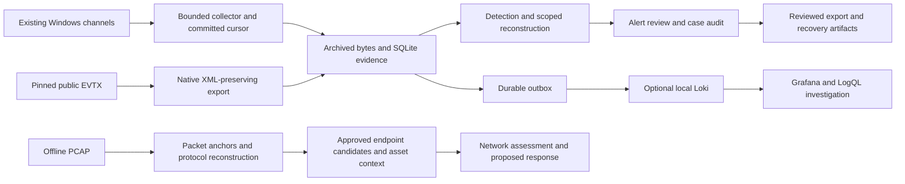

# SOC Investigation & Operations

An evidence-to-case system for Windows telemetry and offline packet investigation, implemented with Python, SQLite, PowerShell and optional native Loki/Grafana. I built it to preserve the path from a received record to a detection lead, an investigation and a recorded analyst decision, including the failures that can interrupt that path.

The system supports incremental collection from existing Windows channels, durable delivery, source-scoped detection, process/session reconstruction, static PowerShell inspection, packet analysis and audited case exports. The core runs without Docker, virtual machines or third-party Python packages. Its deployment boundary is one workstation, with local browser interfaces and a private mutable workspace outside the repository.

**Implementation: v5.0.0. Project documentation consolidated: 9 October 2026.**

[Detailed project report — Vietnamese](docs/PROJECT_REPORT_VI.md) · [Architecture](docs/ARCHITECTURE.md) · [Operating runbook](docs/OPERATIONS.md) · [Acceptance record](docs/ACCEPTANCE.md) · [Release](https://github.com/tngoc1810/soc-investigation-lab/releases/tag/v5.0.0)

## The problem I addressed

A matched string is not an incident. A failed logon is not successful access, a task-creation command is not task execution, and a hostname/IP match is not process identity. Investigation also fails if an event loses its provenance, a collector advances its checkpoint before storing evidence, or an analyst export silently changes after review.

I designed the project around three requirements: keep the original observation recoverable, make every relationship explicit, and retain analyst reasoning separately from detector output. The implementation exposes collection gaps, conflicting identities, ambiguous candidates and unsuccessful delivery instead of turning them into a complete incident narrative.

## Architecture



The Windows and network paths share an evidence policy, not a universal ingestion database. Network results are standalone bundles; approved Sysmon candidates are read from an existing endpoint database. Independent datasets are not automatically joined.

## Implemented capabilities

| Area | Implementation | Executed evidence |
| --- | --- | --- |
| Acquisition | Pinned downloads, original XML, incremental native polling and cursor-gap detection | [Catalog](data/catalog.json), [private collection aggregates](evidence/live/private-collection-proof.json) |
| Storage | Atomic imports, source SHA-256, physical line references, original objects and UTC timelines | [Schema](docs/DATA_SCHEMA.md), [replay validation](evidence/portfolio-validation.json) |
| Delivery | Transactional checkpoint/outbox, persisted payloads, leases, backoff, dead letters and explicit redrive | [Outage/restart recovery](evidence/network/ci-live-responses.json) |
| Detection | Nine Windows event rules, three offline authentication hypotheses and one scoped multi-stage hypothesis | [Rules](rules/windows.json), [evaluation](evidence/advanced/evaluation.json) |
| Reconstruction | Host/domain boundaries, nonzero logon/process GUIDs, observed ancestry and conflicting/missing-link handling | [Session-to-process case](cases/005-multisource-chain/report.md) |
| Hunting/forensics | Eight SQL hunts, fragment completeness/conflicts, bounded decoding and parse-only native PowerShell AST | [Hunts](evidence/operations/hunts.json), [forensics](docs/POWERSHELL_FORENSICS.md) |
| Packet investigation | PCAP anchors, TCP sequence reconstruction, DNS associations, HTTP framing/body hashes and TLS SNI | [Packet case](cases/006-public-network/report.md), [independent decoder](evidence/network/ci-network-responses.json) |
| Context/response | Exact source-approved endpoint candidates, declared asset criticality and owner/approval/impact/rollback | [Attribution/context case](cases/007-network-context/report.md) |
| Analyst workflow | Assignment, revisions, rationale, state transitions, audit chains, case linkage and checked exports | [Reviewed packet](evidence/operations/reviewed-bundle/report.md), [browser validation](evidence/live/browser-validation.json) |
| Recovery/release | Verified database/archive snapshots, restore checks, complete evidence inventories and tested release targets | [Acceptance](docs/ACCEPTANCE.md), [release verification](evidence/network/release-validation.json) |

The live scheduler runs the nine event rules and AUTH-001. AUTH-002/003, graph reconstruction, forensic analysis and PCAP analysis remain explicit offline investigation steps. KQL/SPL are reference translations; SQLite and native Loki/LogQL are the executed query paths.

## Investigation record

| Case | Collection | Assessment |
| --- | --- | --- |
| [001 — Mshta and scheduled-task activity](cases/001-mshta-scheduled-task/report.md) | Eight public Sysmon records | Escalate the process/network/task pattern; payload and recurring task execution remain unproven |
| [002 — Failed authentication](cases/002-authentication/report.md) | 3,561 public failed-logon records; separate 295-record supplement | Investigate concentrated failures; retain explicit-credential observations separately |
| [003 — PowerShell code or quoted data](cases/003-powershell-string/report.md) | Three public PowerShell records | Quoted/printed text does not establish download or execution |
| [004 — Context tuning](cases/004-context-tuning/report.md) | Four constructed observations | Annotate one exact expected-context match without deleting evidence or approving changed variants |
| [005 — Session-to-process chain](cases/005-multisource-chain/report.md) | 2,511 constructed records across three approved sources | Escalate a supported five-stage lead; retain missing-link and authorization limits |
| [006 — HTTP/DNS evidence](cases/006-public-network/report.md) | Two independent public captures, 81 packets | Report selected protocol relationships; acquisition/endpoint/authorization context remains missing |
| [007 — Attribution and business context](cases/007-network-context/report.md) | 17 inert constructed packets, two endpoint candidates and fictional inventory | Prioritize three review leads while keeping attribution and incident verdict open |

The five primary Windows cases contain 6,087 records. Including the independent supplement, the corpus contains 3,867 public and 2,515 constructed records. These are separate collections, not one attack. Operational reliability and network validation use separate controlled inputs.

## Interfaces


The operational console shows collection state, delivery backlog, assigned alerts, original events and review history. Decisions are retained separately from source evidence.


The network report exposes connections, DNS, packet anchors, endpoint candidates, asset context, response proposals and coverage gaps. These are actual, unedited interface captures; the displayed evidence type remains explicit.

## Deploy and operate

Python 3.11+ is sufficient for the core. Native acquisition/export requires readable Windows channels. From a source checkout:

```powershell
python -m soclab live run --channels System --seconds 3600 --interval 10
```

In another terminal:

```powershell
python -m soclab live serve --port 8766
```

The console is at `http://127.0.0.1:8766`. The default workspace is `%LOCALAPPDATA%/SOCInvestigationLab/live/default`. Native records remain local in `held_private`. Security, Sysmon and PowerShell require existing readable channels; missing coverage is visible rather than treated as a clean result.

Offline analysis uses an acquired capture and a fresh destination:

```powershell
python -m soclab network --capture data/local/acquisition.pcap --out output/network/acquisition-01
```

`--endpoint-db`, `--scope` and `--context` add approved endpoint sources and capture-bound inventory. The [operating runbook](docs/OPERATIONS.md) covers acquisition, backend setup, investigation, delivery troubleshooting and recovery. [ARCHITECTURE.md](docs/ARCHITECTURE.md) defines each storage and trust boundary.

## Verification and measured results

The v5 code commit `0032c43420d97e6bb71177aaebb76e1e89f0427d` passed [all seven CI jobs](https://github.com/tngoc1810/soc-investigation-lab/actions/runs/37617174984). Downloaded logs confirm 127 tests in each Windows/Linux Python 3.11/3.12 matrix job. Separate jobs checked Sigma conditions, actual native Loki responses and independent packet decoding. Downloaded artifact ZIPs matched GitHub digests, exact inventories and tested Python source hashes.

```powershell
python -m unittest discover -s tests -v
python scripts/verify_checksums.py
```

| Result | Measurement boundary |
| --- | --- |
| 48 hunt executions | Eight queries across five Windows primary collections and one independent supplement |
| 60 native records retained with original XML | Finite v4 collection: 21 System/39 PowerShell; six text-rule matches remain unreviewed; Security/Sysmon unavailable |
| 19 unique records returned after outage/restart | Controlled input, actual HTTP 503, fresh process and actual Loki queries |
| 81 public packet tuples/40 DNS messages/two HTTP requests independently checked | Selected protocol fields compared with dpkt; all 17 constructed IPv4/transport checksums also passed |
| 24.2× lower median graph time | Six fresh processes, 1,200 constructed authentication records/200 incomplete candidates, identical result digest; not general throughput |
| Graph holdout precision 66.7%, recall 50%, F1 57.1% | Eight related constructed variants; temporal baseline F1 is higher at 72.7% |
| 145.51 MiB combined current working set | Historical idle snapshot of selected backend/viewer processes; excludes OS/browser/collector; not a total RAM ceiling |

[ACCEPTANCE.md](docs/ACCEPTANCE.md) records verification gates. [VALIDATION.md](docs/VALIDATION.md) retains dated source records, including the initial public-download CI failure and its repair. Passing regressions does not establish field detection accuracy.

## Delivery boundary

This is a completed single-workstation implementation with reproducible investigation and reliability records. Enterprise deployment, authenticated multi-user operation, automated containment, continuous packet capture, high-volume endurance and an independent network accuracy benchmark are outside its delivered scope. The PCAP parser supports a documented, bounded IPv4/classic-PCAP subset.

| Directory | Responsibility |
| --- | --- |
| `soclab/` | Evidence storage, detection, reconstruction, transport, analyst workflow and network engine |
| `scripts/` | Native acquisition/export, pinned runtime management and reproducible validation |
| `cases/` | Seven reports with observations, assessments and missing evidence |
| `rules/`, `queries/`, `playbooks/` | Executable policies, Sigma/reference queries and investigation procedure |
| `data/` | Acquisition catalogs and constructed inputs; raw/private files are ignored |
| `deployment/` | Runtime lock, backend configuration and Grafana dashboard |
| `evidence/` | Selected responses, genuine screenshots and checksum inventory |
| `docs/` | Complete report, architecture, operating procedure, acceptance and dated engineering records |

Development and initial analysis used Codex assistance. Source authors are credited in the acquisition catalogs and case reports. Private host telemetry, credentials and original third-party acquisitions are excluded from the public repository. Older instructional documents remain historical supporting material; the delivered project is described by the documents linked above.
