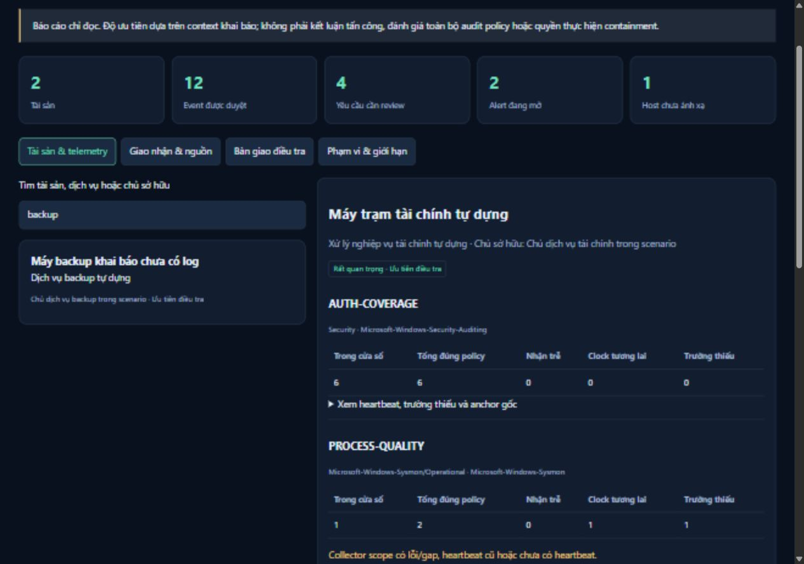

# Case 008 — Chất lượng telemetry và bàn giao theo dịch vụ

**Loại dữ liệu:** record, inventory, reviewer và collector diagnostic đều tự dựng. **Mốc đánh giá:** 09/10/2026 03:00 UTC, tương đương 10:00 UTC+7. **Kết luận:** chưa kết luận sự cố. Đây là phép kiểm chứng hệ thống, không phải outage/incident thật.

## Bài toán và acquisition

Tôi dựng collection có auth lead và khoảng trống để kiểm tra bàn giao. Máy tài chính có sáu auth observation nhưng thiếu field process/network. Backup khai báo criticality high chưa có nguồn Security. Một host chưa có mapping owner. Nếu chỉ đếm alert, backup dễ bị bỏ qua; nếu chỉ đếm event, future timestamp dễ tạo cảm giác có telemetry hiện tại.

Fixture tạo năm JSONL batch: hai security, một sysmon, một powershell và một unmapped, tổng 12 accepted event. Profile duyệt năm scope; backup-security có source set rỗng vì chưa có acquisition. Source được archived/hash tại ingest; readiness hash lại archive, đối chiếu line, alert audit và outbox trước output.

Không phát input lên endpoint hoặc tạo network traffic. Chuỗi PowerShell là dữ liệu inert. Diagnostic constructed_channel_read_failed là fixture, không lỗi channel thực tế.

## Quan sát

| Policy/đối tượng | Quan sát | Nhận định trong scope |
| --- | --- | --- |
| AUTH-COVERAGE | Năm 4625/một 4624 đúng Security/provider, đủ field, trong window | Không quality issue theo policy; auth lead vẫn cần điều tra |
| PROCESS-QUALITY | Hai đúng-channel Sysmon 1; current thiếu ParentImage, future 300 giây | Giữ missing/future/received-before-event; future không tăng current count |
| NETWORK-QUALITY | Sysmon 3 thiếu DestinationPort | Không đủ tuple để attribution chắc chắn |
| SCRIPT-COVERAGE | 4104 cũ 7.200 giây, nhận gần as_of, thiếu MessageTotal | Lag/incomplete field; chưa chứng minh fragment đầy đủ |
| Collector sysmon | Updated cũ 900 giây, gap 1, error tự dựng | Review scope; chưa chứng minh sensor host ngừng chạy |
| Sai channel | Sysmon provider/event 1 nhưng channel Security | Một unmatched-policy event, không tăng Sysmon coverage |
| BACKUP-AUTH-COVERAGE | Không observation/heartbeat | Thiếu căn cứ, không kết luận audit tắt hoặc backup an toàn |
| WS-UNMAPPED | Một System observation | Inventory/owner chưa có, giữ riêng không tự gán priority |

Live detector thực sự chạy và giữ hai alert WIN-001/AUTH-001. Alert owner chưa phân công. Readiness không gán owner theo asset context, đổi severity hoặc verdict.

## Bàn giao

Headline: **hai asset, 12 event, năm requirement, bốn cần review, hai active alert, một unmapped host**. Finance và backup đều ưu tiên review theo critical/high context; nguyên nhân khác nhau được giữ riêng.

Finance cần giữ acquisition, đối chiếu clock/ParentImage/tuple/fragment và review auth/process lead với đầu mối SOC. Backup cần xác minh logging expectation và collection state với chủ dịch vụ. Unmapped host cần inventory từ nguồn xác minh, chưa có owner do engine tự tạo.

Biên bản giữ approval, business impact, rollback và verification. Chưa gửi người nhận/chưa containment; self-declared owner chưa đồng nghĩa người có quyền chấp thuận thay đổi. Không có incident verdict được tạo từ quality gap.

## Artifacts và tái lập

[Context](../../evidence/service/context.json) · [JSON](../../evidence/service/report/readiness.json) · [Biên bản](../../evidence/service/report/ban-giao.md) · [Manifest](../../evidence/service/report/manifest.json) · [Validation](../../evidence/service/local-validation.json)

```powershell
python scripts/validate_service_readiness.py --run-id case008-20261009 --out output/case008-20261009-validation.json
```

Run mới tạo workspace/context/report riêng. Artifact kiểm source hash, summary, clock/channel, readonly persistent bytes và manifest. as_of cố định tái lập assessment; không phục dựng database state quá khứ.



## Giới hạn

Case kiểm logic/failure handling trên input biết trước, chưa đo fleet coverage/production false positive rate/sensor uptime. Missing fields tính toàn approved collection. Readiness đọc state/audit đã giữ; analyst vẫn phải xác minh incident với nguồn bổ sung và authority.
