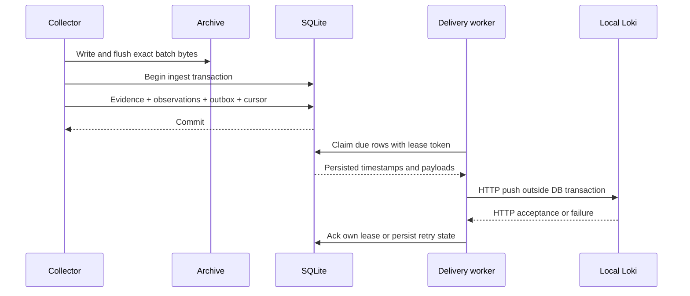

# Architecture and design decisions

This specification describes the v5.0.0 implementation as a single-workstation system. It consolidates the dated engineering records without changing the tested engine. The [project report](PROJECT_REPORT_VI.md) contains the investigation rationale; [OPERATIONS.md](OPERATIONS.md) defines operator procedures.

## Component map

| Boundary | Modules/assets | Input | Retained output |
| --- | --- | --- | --- |
| Native acquisition | `collector.py`, `scripts/export_evtx.ps1`, collection scripts | Existing readable Windows channels or acquired EVTX | Original XML and normalized JSONL; cursor/reset diagnostics for polling |
| Evidence | `events.py`, `store.py` | Validated event objects | Sources/events in SQLite, received object, source hash/line/UID |
| Event detection | `detections.py`, `correlation.py`, `rules/windows.json` | Scoped stored events and policy | Findings, rule metadata, original anchors and analysis manifest |
| Reconstruction | `context.py`, `investigation.py` | Events and exact approved source set | Process inventory, observed/missing/conflicting links and bounded chain leads |
| Static forensics | `forensics.py`, `scripts/inspect_ast.ps1` | Retained script fragments/encoded text | Completeness/conflict results, decoded inert data and parse-only AST metadata |
| Operational coordination | `live.py` | Archived batches, collector cursor and scheduled policy | Observations, batches, durable outbox, detection runs, alerts and alert audit |
| Backend | `loki.py`, `deployment/loki.yaml`, runtime lock | Approved public/synthetic replay or synthetic operational outbox | Actual API results; original time/identity in JSON |
| Historical case decisions | `operations.py`, `webapp.py` | Chosen collection/finding plus analyst input | Separate case state, audit, original anchors and revisioned ZIP |
| Live interface | `liveweb.py` | Operational workspace and analyst input | Loopback queue/status/review/packet interface and metrics |
| Network | `network.py`, `network_report.py` | PCAP; optional endpoint DB, scope and asset context | Protocol observations, candidates, readiness and standalone report bundle |

The analysis engine uses custom Python policies. Loki is a transport/query backend, and Grafana renders selected streams. Sigma condition parsing is a separate portability check. There is no live Sigma engine, live KQL/SPL backend or network-to-live-alert ingestion path.

## Storage ownership

### Historical evidence

An import hashes the received JSONL bytes and stores each original event object. A physical line remains a physical line even when blank lines are skipped. `event_uid` binds a source hash to that line; record ID alone is insufficient because it can overlap across channel, host or file.

Imports validate the complete input within a transaction. Malformed nonblank input rolls back the import. Byte-identical imports are idempotent. Separate overlapping source files remain separate acquisitions; historical import does not pretend to deduplicate every real-world observation.

Analysis bundles stage their complete contents before publication to a fresh destination. Source/rule hashes and correlation parameters identify the actual policy/input. A hash of exported JSONL can vary with serializer/platform while the original EVTX hash remains the cataloged acquisition check.

### Operational workspace

The Windows default is `%LOCALAPPDATA%/SOCInvestigationLab/live/default`; explicit private workspaces may also reside under ignored `data/local`. Keeping a continuously written SQLite database outside the OneDrive source checkout is the default operating choice.

`live.sqlite` owns evidence, observation fingerprints, accepted batches, outbox rows, collectors, detection runs, alerts and alert audit. `cases.sqlite` owns case snapshots/audit. `archive/` owns the exact received batch bytes. Original source evidence is not edited by an analyst decision.

The observation fingerprint excludes poll provenance while retaining scope, kind, identity, timestamp, content and original XML. A repeated poll can skip the same observation; a reused record ID with changed content remains distinct. Physical acquisition references are still retained.

### Network bundles

`network.json` is the machine-readable result, `index.html` is the self-contained viewer and `manifest.json` hashes the result files. Original PCAP is retained separately. Context and endpoint scope are independently supplied, hash-bound documents rather than facts discovered by the parser.

The viewer bounds its displayed lists while the JSON retains the complete accepted inventory. Standalone HTML renders data as text and blocks external connections. It is a local report, without application accounts or a server-side case workflow.

## Commit and delivery sequence

A crash before the ingest commit can leave an unreferenced archive but cannot commit a new cursor without corresponding accepted evidence/outbox. HTTP and SQLite acknowledgment are separate boundaries: acceptance followed by a crash can cause a repeat. Delivery is at-least-once.

| Queue state | Meaning | Exit |
| --- | --- | --- |
| `held_private` | Native private-host observation retained locally | No backend delivery switch in this implementation |
| `pending` | Eligible synthetic observation awaiting due time | Worker claim |
| `sending` | Owned by a lease token | Own-token acknowledgment or expiry/retry |
| `delivered` | Local acknowledgment after backend acceptance | Retained record |
| `dead_letter` | Retry limit reached; payload/evidence retained | Explicit redrive with actor/reason |

Workers claim at most 250 rows; leases expire after 180 seconds. Backoff persists and caps at 300 seconds. Eight failed delivery cycles lead to dead letter. Redrive records a maintenance entry. An original workspace and its recovered copy must not run as simultaneous delivery agents.

## Collection and detection boundaries

The first collection reads a recent bounded slice, normally 20 records. Incremental polls use committed EventRecordID and at most 200 records, in ascending order. The retained XML fingerprint detects a changed boundary; lower IDs, missing boundary/retention movement and channel failures are visible.

Reset recovery bootstraps recent data and increments a gap counter. It does not recover overwritten records. Collection does not install Sysmon, enable audit policy, clear logs or execute recorded commands.

Scheduled live evaluation runs nine event rules plus AUTH-001 within one explicitly named collection. Its default event-time window is 600 seconds with 120 seconds future-clock allowance. More than 10,000 records/window aborts evaluation. Older arrivals remain stored but are outside this scheduler; there is no distributed watermark.

Offline authentication and graph policies retain source boundaries. Graph scope approves exact hashes, while identity/relationship checks retain host, domain, GUID validity, time and observed ancestry. Conflicting process records suppress unsupported causal links. Missing links do not become benign verdicts.

## Decision model and exports

The state graph is `new → triaged → investigating`, with escalation/closure from investigation and a return from escalation to investigation. Closed states have no review transitions. Live alert closure uses `suspicious_activity`, `expected_activity` or `insufficient_evidence`; the separate case workflow uses `confirmed_in_lab`, `expected_activity` or `insufficient_evidence`. Actor labels are self-declared, and stale revisions fail. A linked case does not automatically copy an alert verdict.

The audit stores the previous hash and complete state snapshot. Reads check the chain and agreement with the current state. This is relative integrity, not a signature or protection against an owner rewriting/resealing the database. An independently retained export digest supplies a comparison anchor.

Alert promotion uses an ID derived from the alert to recover the two-database case/link boundary. A retry verifies the existing case's source scope/evidence UID set before linking it. A case and an alert remain separate workflows; linkage does not silently synchronize verdicts.

Exports use new revision-specific names and publish only after staging a complete archive. The case export's exclusive hard-link publication requires filesystem hard-link support. Reload retains a download link only after comparing exact file inventory/content to the audited snapshot. Snapshots retain SQLite backups and original archives; restore verifies hashes, inventory, allowed paths and database integrity.

## Network inference boundaries

| Layer | Supported subset | Important exclusion |
| --- | --- | --- |
| Acquisition format | Classic PCAP 2.4, both byte orders, micro/nanosecond | PCAPNG rejection; no capture sensor |
| Link/IP | Ethernet up to two VLAN tags, raw IPv4, Linux cooked v1 | IPv6/IP fragments/unsupported transports become gaps |
| TCP | Sequence wrap/order/retransmission, bounded stream | Gaps/conflicting overlaps suppress application inference; reuse without observed SYN can remain ambiguous |
| DNS | Bounded compression, questions/rcode and selected record data | No arbitrary record-format coverage; TCP message time approximate |
| HTTP/1 | Request framing/headers, Content-Length and complete-body hash | At most 100 requests/direction; no response acceptance, chunked-body support or HTTP/2 |
| TLS | Supported first ClientHello SNI | No decryption/certificate authentication/JA3; cross-record handshake fragmentation unsupported |

DNS-to-connection candidates require same captured client, answer address/name chain and bounded TTL/time. Endpoint candidates additionally require exact approved source hashes, Sysmon provider/channel/event 3, protocol, tuple and ±2 seconds. Neither association is process identity proof.

Asset inventory is bound to capture hash and validates unique IPs plus owner/service/classification/criticality. High/critical context changes priority to `review_first`; it does not create confidence or a compromise verdict. Proposed actions retain owner, approval, impact, rollback and verification, with no execution capability.

## Security and deployment boundary

| Boundary | Implemented control | Residual limitation |
| --- | --- | --- |
| Acquisition integrity | Pinned size/hash, exact HTTPS public-capture redirect path | Hash is not authenticated acquisition or completeness |
| Historical/live evidence | Full original object, source anchors, scope checks | Local filesystem owner can alter storage |
| Private telemetry | Private cache/ignored path, `held_private`, publication exclusion | Deliberate copying/relabeling by an owner is not prevented |
| Browser writes | Exact loopback Host/Origin, per-process CSRF token, bounded JSON/revisions | No authenticated users/RBAC; local hostile processes are outside this protection |
| Browser rendering | `textContent`; inert JSON embedding; network report connection restrictions | Sensitive content still requires retention/access control |
| Backend requests | Loopback transport with redirects refused | Local backend is not a signed external custody service |
| Runtime lifecycle | Official pinned downloads, hashes, owned executable/PID checks, failed-start cleanup | Operator still controls local process permissions |
| Reviewed exports | Staged fresh publication, audited payload comparison and manifest | Filesystem requirements; retained anchors needed for divergence checks |

Interfaces bind locally: historical viewer 8765, operational console 8766, static network viewer conventionally 8767, Loki 3100 and Grafana 3000. The project does not expose them to a network or install an autostart service.

## Capacity and engineering decisions

Operational limits include 100,000 stored events, 10,000 non-delivered outbox rows (including private holds) and a 512 MiB storage admission guard. Each incoming operational batch caps at 500 records/16,000,000 bytes. Graph reconstruction caps input at 100,000 events. Network input caps at 32 MiB/50,000 packets/2,000 flows and 128 KiB stream span; scope/context documents cap at 128 KiB. These are rejection policies, not measured capacity or throughput guarantees. Native held-private accumulation therefore also requires an explicit retention/workspace decision; it is not an unlimited private archive.

Python/SQLite makes the transaction and recovery model inspectable on one workstation and keeps core deployment small. Exact scope improves attribution discipline but loses recall when essential telemetry is absent. At-least-once delivery retains uncertainty instead of inventing exactly-once semantics. Bounded protocol support keeps exclusions explicit rather than simulating a full network IDS.

Multi-user authentication, independent signatures, retention automation, high availability, fleet source registration, external threat intelligence, containment approvals/execution and high-volume endurance remain outside this implementation. The [acceptance record](ACCEPTANCE.md) identifies what was actually executed, including weaker held-out graph results and historical-only resource measurements.
