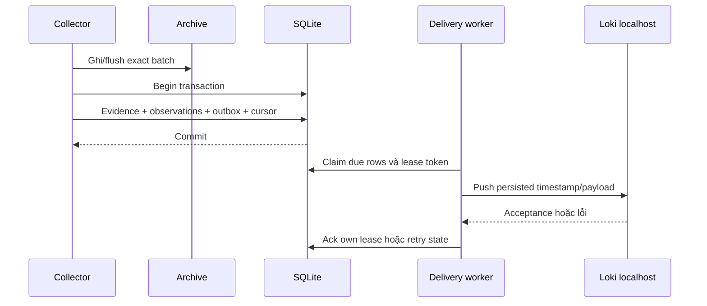

# Kiến trúc và quyết định thiết kế

Tôi triển khai v6.0.0 theo phạm vi một workstation. Windows acquisition, investigation, durable delivery, case review, packet analysis và service readiness có input/output riêng; cùng giữ nguyên tắc truy lại bằng chứng và phân biệt observation/assessment/decision. [Báo cáo](PROJECT_REPORT_VI.md) ghi lý do điều tra; [runbook](OPERATIONS.md) định nghĩa thao tác vận hành.

## Thành phần và ownership

| Thành phần | Module | Nguồn vào và sản phẩm giữ lại |
| --- | --- | --- |
| Thu nhận | collector.py, native export scripts | Channel/EVTX hiện hữu → XML gốc, JSONL, cursor/gap diagnostic |
| Evidence | events.py, store.py | Validated objects → sources/events SQLite, original object, hash/line/UID |
| Detection | detections.py, correlation.py | Scoped records/policy → findings và analysis manifest |
| Reconstruction | context.py, investigation.py | Exact source scope → observed/missing/conflicting process/session links |
| Static forensics | forensics.py, inspect_ast.ps1 | Fragment/encoded text → completeness/decode/parse-only AST |
| Operational | live.py | Batch/cursor → observations/outbox/alerts/audit/detection runs |
| Backend | loki.py, deployment config | Approved replay/synthetic outbox → actual API queries; identity/time giữ trong JSON |
| Case | operations.py, webapp.py | Analyst input/evidence → separate state/audit/revisioned packet |
| Live UI | liveweb.py | Operational state → loopback status/review/export/metrics |
| Network | network.py, network_report.py | PCAP/scope/context → packet anchors/protocol/candidates/report |
| Service v6 | service_readiness.py, service_report.py | Current operational snapshot/profile → quality/priority/handoff bundle |

Core detection là custom Python policy. Loki là transport/query backend, Grafana render selected streams. Sigma là condition portability validation; chưa có live Sigma/KQL/SPL engine. Network không tự chuyển result vào live alert database.

## Lưu trữ và identity

Historical import hash exact JSONL bytes. Physical line giữ cả vị trí blank lines; UID bind source hash/line, không dùng record ID đơn lẻ. Complete input được validate trong transaction; malformed nonblank input rollback, byte-identical source idempotent. Overlapping historical acquisitions vẫn riêng.

Operational mặc định ở `%LOCALAPPDATA%/SOCInvestigationLab/live/default`, tránh đặt continuous-write DB trong OneDrive source. `live.sqlite` giữ sources/events, observations, accepted batches, outbox, collectors, detection runs, alerts/audit. `cases.sqlite` giữ analyst case state/audit. `archive/` giữ exact received batch bytes. Review không sửa source event.

Operational observation fingerprint giữ scope/kind/identity/time/content/original XML nhưng loại poll provenance. Lặp cùng observation có thể skip; record ID tái dùng với nội dung khác vẫn khác. Physical acquisition anchor giữ nguyên nguồn accepted đầu tiên.

Network bundle giữ network.json/index.html/manifest, PCAP gốc lưu riêng. Service bundle giữ readiness.json/index.html/ban-giao.md/manifest. Context không được trình bày như dữ kiện engine tự khám phá: network bind capture hash; service bind exact scope/source set cùng expiry.

## Transaction và delivery

Crash trước ingest commit có thể để archive chưa tham chiếu; không commit cursor mới thiếu accepted evidence/outbox. HTTP acceptance và local acknowledgment không cùng transaction, nên delivery **at-least-once**; crash giữa hai bước có thể gửi lặp.

| Queue state | Nghĩa và xử lý |
| --- | --- |
| held_private | Native private records giữ local, không có delivery switch |
| pending | Synthetic eligible record đợi due time |
| sending | Lease-owned; ack đúng token hoặc expiry/retry |
| delivered | Local ack sau backend acceptance, giữ record |
| dead_letter | Hết retry; giữ payload/evidence, redrive explicit actor/reason |

Claim tối đa 250 row, lease 180 giây, backoff cap 300 giây, tám failed cycles → dead letter. Redrive giữ maintenance entry. Không chạy original/restored workspace như hai delivery agent song song.

## Collection, detection và suy luận

Bootstrap thu recent slice, thường 20 record; poll theo committed EventRecordID, tối đa 200 ascending record. Boundary XML fingerprint, lower ID, missing/retention boundary và read failure tạo diagnostic. Reset bootstrap recent/increment gap, chưa phục hồi overwritten history. Không cài Sysmon/enable audit/clear logs/chạy recorded commands.

Live scheduler chạy chín event rule +AUTH-001, window mặc định 600 giây và future allowance 120 giây, cap 10.000 event/window. Old arrivals vẫn stored nhưng ngoài scheduler; chưa có distributed watermark. Offline auth/graph dùng source scope và host/domain/nonzero GUID/time/observed ancestry. Conflicting process suppress unsupported causal link; missing link không tạo benign verdict.

PCAP hỗ trợ classic 2.4 hai endian, micro/nanosecond; Ethernet tối đa hai VLAN/raw IPv4/Linux cooked v1. IPv6/fragments/unsupported transports giữ gap; PCAPNG reject. TCP xử lý sequence wrap/order/retransmission, gap/conflicting overlap suppress app inference; tuple reuse thiếu SYN có thể ambiguous.

DNS có bounded compression/selected record data. HTTP/1 có request/header/framing/complete-body hash, tối đa 100 request/direction, chưa chunked/HTTP2/response acceptance. TLS giới hạn first ClientHello/SNI, chưa decryption/cert authentication/JA3/cross-record fragmented handshake.

DNS association cần captured client/answer/name chain/TTL/time. Endpoint candidate cần exact approved source set, Sysmon provider/channel/event3, protocol/tuple/±2 giây; vẫn candidate, chưa process identity proof. Criticality context đổi thứ tự review, không confidence/compromise verdict.

## Readiness v6

Service reader mở SQLite mode=ro/query_only trong transaction; profile read bounded/duplicate-key rejection/expiry check. Batch set khớp exact approval, observation accepted count và source kind. Archive hash/physical line/original object, alert audit/evidence anchor và outbox consistency phải đúng trước output.

Asset mapping dùng host aliases duy nhất; mỗi asset có policy. Quality tách event freshness, ingest lag, future/negative clock, required fields và scope heartbeat. Không event chưa đủ chứng minh audit tắt; scope heartbeat chưa đủ chứng minh từng host sensor khỏe. Unknown host/alert giữ riêng.

Readiness chỉ dùng **current snapshot**; as_of là mốc đánh giá thời gian, không historical database version. SQLite có thể tạo coordination SHM/zero-frame WAL; readonly proof không claim mọi file byte bất biến. Snapshot hash bind selected inputs/current alert state; không signature.

Handoff có proposed owner/approval/impact/rollback/verification, chưa có notification/action. Output fresh, render staging/rename với bounded Windows retry; không hỗ trợ concurrent publisher cùng destination. [ENGINEERING_V6.md](ENGINEERING_V6.md) ghi schema, công thức và test cụ thể.

## Decision/audit/export

State graph `new → triaged → investigating`, escalate/close từ investigation, return từ escalated; closed không review transition. Live verdict suspicious_activity/expected_activity/insufficient_evidence; case riêng confirmed_in_lab/expected_activity/insufficient_evidence. Actor self-declared, stale revision fail, linked case không auto-copy verdict.

Audit hash previous entry/full snapshot và so current state; local owner có thể reseal nên chưa signature. Retained export digest là independent comparison anchor. Alert promotion dùng deterministic ID/retry để recover boundary hai database, verify scope/evidence trước link; chưa distributed transaction.

Case export staging/exclusive hard-link publication cần filesystem support. Reload kiểm exact inventory/content theo audit trước giữ download link. Snapshot dùng SQLite backup/archive hashes; restore destination mới và verify allowed paths/inventory/integrity. Interrupted restore có thể để partial directory, chưa success.

## Deployment, security và giới hạn

| Ranh giới | Control | Phần còn lại |
| --- | --- | --- |
| Acquisition | Pinned size/hash, exact HTTPS redirects | Chưa authenticated custody/completeness |
| Private telemetry | Private paths, held_private, publication exclusion | Filesystem owner vẫn copy/relabel được |
| HTTP write | Exact loopback Host/Origin, CSRF, bounded JSON/revision | Chưa authenticated RBAC, chưa chống local hostile process |
| Render | textContent/inert JSON, static report CSP | Retention/access control vẫn cần riêng |
| Backend | Loopback request, refuse redirects | Không signed external custody |
| Runtime | Official pinned downloads/owned PID cleanup | Operator kiểm local process permissions |
| Export | Fresh staged publication/audited content/manifest | Retained anchor/filesystem support cần đúng |

Loopback ports: historical 8765, live 8766, network 8767, service 8768 theo runbook, Loki 3100/Grafana 3000. Không autostart service/public network exposure. Core không VM/Docker/dependency bắt buộc.

Capacity guards: operational100.000 stored events/10.000 non-delivered rows/512 MiB admission; batch500 record/16.000.000 bytes; graph100.000 events; network32 MiB/50.000 packets/2.000 flows/128 KiB stream; network scope128 KiB; service50.000 events/64 MiB archive/256 KiB profile. Đây là reject policy, không measured throughput/peak RAM. Private hold accumulation cũng cần retention/workspace decision.

HA, fleet IAM, retention automation, independent signatures, external intelligence, continuous network sensor, containment và production endurance chưa triển khai. [Nghiệm thu](ACCEPTANCE.md) ghi phạm vi đã chạy và các kết quả yếu hơn baseline.
