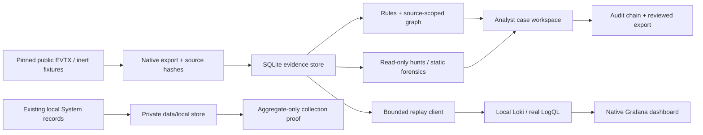

# Evidence-to-case operations: design and trade-offs

I wanted the lab to answer a question that an attractive dashboard cannot settle: can someone reproduce the observation, understand the analyst's decision, and see what evidence is still missing? Version 3 connects the earlier investigation engine to an actual log backend and a separate decision workspace. It keeps the public sample boundaries intact.

Development and the initial reviews used Codex assistance. The measurements below are lab results. They do not establish production experience or enterprise-scale detection accuracy.

## Data flow

The private collector is deliberately separate. Its original XML, hostname, accounts and messages do not enter the published screenshots, replay backend or Git history. It reads at most 200 existing System records and does not enable logging, install an agent or generate an attack.

## Actual backend, bounded scope

`soclab/loki.py` uses the standard library and accepts only a plain localhost HTTP origin. HTTP redirects are rejected so an accepted localhost origin cannot redirect the request to another destination. It pushes batches of at most 500 events; the default is 250. HTTP requests have a timeout and up to three attempts for selected transient failures. A transport retry is at-least-once delivery. This implementation has no durable delivery queue or exactly-once guarantee.

The stream labels are job, case ID, dataset kind, replay mode and replay run. Commands, accounts, IPs and GUIDs stay in JSON fields. Run IDs distinguish experiments but still create new streams; the design is appropriate for a few deliberate portfolio replays, not an unbounded fleet or continuously generated run IDs. Source SHA-256, physical source line and event UID let the analyst pivot back to SQLite. The backend JSON is a normalized view, not a replacement for EVTX acquisition files.

Historical mode retains normalized source timestamps. Replay-now mode assigns arrival timestamps while retaining `original_timestamp` and a visible replay label. The dashboard uses the latter only for the eleven meaningful case-005 records. The 2,500 background records remain in historical replay. No command contained in these records is executed.

The backend validator performs more than a successful POST: it checks all five collection counts, pivots to a specific UID and confirms source hash, then checks event-type counts in the dashboard stream. Its artifact retains the actual LogQL expressions and responses. Independent datasets are never joined into a single incident by the backend adapter.

## Historical replay failure and fix

The first tests accepted the old samples but returned empty query results. Acceptance did not imply immediate searchability. Loki's default recent-ingester lookback, the filesystem-store lookback derived during startup, chunk flushing and index resynchronization all matter for freshly ingested years-old evidence.

The lab config queries ingesters without a recent-only bound, uses a negative filesystem-store lookback, and resynchronizes TSDB indexes every five seconds. The validator explicitly flushes this isolated instance and polls boundedly for the reviewed counts. Query sharding is unnecessary for these small collections. The query-length limit accommodates internal lookups across the historical time span; the validator itself sends case-specific selectors and narrow evidence ranges.

These are settings for a new, small loopback lab. I would not copy them into a production multi-tenant Loki deployment. The reasoning was checked against the [configuration reference](https://grafana.com/docs/loki/latest/configure/), [HTTP API](https://grafana.com/docs/loki/latest/reference/loki-http-api/) and [the pinned release's startup logic](https://github.com/grafana/loki/blob/v3.7.8/pkg/loki/modules.go), then validated against the installed binary.

## Native deployment and resource budget

The runtime lock pins official Windows Loki and Grafana archives and their SHA-256. The installer checks the complete archive before extraction. Grafana's larger archive supports bounded, resumable range transfers; a resumed download is accepted only after the assembled archive matches the official digest. Download segments use small buffers.

The managed cache is `%LOCALAPPDATA%\SOCInvestigationLab\runtime`, outside the repository and OneDrive. There is no Windows service or autostart registration. HTTP and gRPC bind to loopback; the launcher checks port conflicts, waits for readiness and stops its newly started processes on readiness failure. Stop/Status use recorded PID plus executable path, rather than killing every Python or Grafana process.

Grafana gets a fresh random local administrator password, with anonymous access and signup disabled. The generated configuration and credential file remain in the local cache. This is not a hardened shared deployment: any local user with access to that cache can read the credentials. Loki itself has no built-in authentication layer; binding it to loopback is part of this single-user lab's boundary. See the [official local installation guide](https://grafana.com/docs/loki/latest/setup/install/local/).

`GOMEMLIMIT=128MiB` is a Go heap-management target, not a hard cap on process RSS or total laptop memory. The resource artifact records actual process working sets after queries. It excludes browser memory, OS cache and other apps. The core can be used with both native services stopped; Loki can also run alone.

The initial Grafana profile started thirteen bundled datasource helper processes although only Loki was needed. This fresh lab profile disables unused plugins, leaving one Loki helper. Stop/Status include children with the recorded Grafana parent PID and an executable inside the managed Grafana directory. The published snapshot includes all three relevant processes, totaling 151.41 MiB; it is not an upper bound or a simultaneous sum of peaks.

Core event iteration and source listing use SQLite URI read-only mode. Inspecting evidence cannot recreate a dropped index or change the source database; a regression test compares its bytes before and after reads. Report publication stages a complete directory and performs one final rename. Bounded retries handle Windows sharing/access failures from transient readers while preserving existing bundles. Persistent permission failures abort without a partial final bundle.

## Analyst decisions and concurrency

Source evidence databases stay read-only in the web routes. A separate SQLite database stores operations cases and their audit rows. A case starts at revision 1. Every note, transition or evidence attachment needs the current revision; a stale update fails rather than overwriting another decision. Mutations use an immediate transaction so concurrent requests cannot both commit from the same revision. In v3.0.1, case-detail and board reads also use one explicit read transaction; case state and its audit cannot come from different committed revisions. The board verifies the audit before displaying each case.

The allowed path is new → triaged → investigating → escalated, with closure from investigating/escalated and a return from escalated to investigating. Closing requires a rationale and one of three explicit verdicts: confirmed within the lab, expected activity or insufficient evidence. Closed cases cannot receive new evidence or be reopened through this small implementation. Notes can add a later clarification without changing the closure verdict.

Evidence attachment validates each UID against the selected source collection, retains the complete original input object and preserves earlier anchors. The interface supports timeline selection across searches within one collection. A case is limited to 30 evidence records. Collection changes clear the selection; the server rejects attachment to a different source case. Actor labels are self-declared, not authenticated identities.

## Audit and export integrity

Each audit payload includes the case ID, sequence, action, actor, rationale, timestamp and complete case snapshot. Its digest covers the previous digest plus canonical JSON. Verification checks sequence continuity, every hash and agreement between the final snapshot and current case state.

The audit is append-only through the application API. The database owner can still edit the file, delete a tail and rewrite the case, or reseal an entire history. An independently retained export anchor helps detect later divergence. Hashing is relative integrity, not a digital signature or collection authenticity.

Exports use a revision-specific ZIP name. In v3.0.1, a complete ZIP is staged and closed before an exclusive hard link publishes it in the destination directory. The filesystem must support hard links. A failed ZIP write leaves no partial final packet. Reload restores a retained download link only after checking its exact file set and every payload against the audited snapshot. They contain case state, audit history, original retained event objects, an analyst report and a file-hash manifest. Fixed ZIP metadata makes identical input content deterministic. A later export cannot silently overwrite the same reviewed revision. EVTX bytes must still be retained separately; the packet's JSON and source references do not reconstruct the acquisition file.

The published example contains only synthetic case-005 evidence. The reproducible script creates the initial four decisions and nine chain anchors. A subsequent browser check attaches Security 4698 record 110, yielding revision 5 and ten anchors. The two exports represent different review stages, not a changed earlier packet.

## Local HTTP boundary

Writes require an exact loopback Host/port, a matching Origin, a per-process unpredictable CSRF token and bounded JSON with Content-Length. There is no permissive CORS policy. The server rejects unsupported actions, oversized bodies, stale revisions, invalid state transitions and evidence outside the chosen source collection. The browser renders event data and analyst text with `textContent`.

This protects the intended localhost browser flow from ordinary cross-origin writes. It is not user authentication, role-based authorization or protection from another process that already has filesystem access. Multi-user deployment, TLS, server-side identities, independent signing, service isolation and a retention policy would need additional design.

## Indexing improvement

Version 2 rescanned all events for each successful logon and rescanned tasks for each risky process. Version 3 builds identity/time, session and ancestor/task indexes once. Binary search finds the relevant failure window. This reduces repeated unrelated scans while preserving the source-scope, domain, IP, logon type, nonzero GUID and temporal checks.

Six fresh processes compared the released v2 file with v3 on 1,200 constructed auth records and 200 incomplete candidates. All six produced the same result digest. The recorded medians are approximately 1.53 s and 0.046 s. This demonstrates the targeted improvement on an auth-heavy workload; it does not promise that every case is 33 times faster. Large failure windows can still require large output lists. Graph reconstruction is capped at 100,000 events; v3.0.1 enforces this cap while reading, before sorting or materializing an oversized iterable. The fresh 6 October comparison measured 0.332 s versus 0.0137 s (24.2×); see the dated [review](QUALITY_REVIEW.md).

## Limits and next engineering decisions

The detector remains a custom Python policy, separate from LogQL. Grafana is a replay/hunting surface; alerts are not continuously evaluated there. There is no EDR, packet capture, autonomous containment, threat-intelligence service or live KQL/SPL execution. PowerShell switch handling recognizes selected exact forms and is not a full Windows command-line parser.

The 20 evaluation scenarios are small and related. Held-out graph recall remains 50%; the temporal baseline still has the higher held-out F1. The v3 indexing change does not tune thresholds to hide those errors. A representative independent labeled dataset, operational alert-volume measurements, durable ingestion and a multi-user case model would be the next substantive steps.
