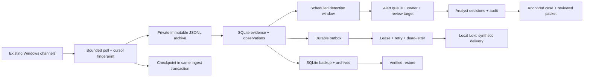

# A single-host SOC operations pilot

Version 4 adds an operational path alongside the historical casebook: bounded Windows polling, a committed evidence/checkpoint boundary, durable delivery, scheduled event-time detection and an analyst queue. The core still uses Python's standard library and SQLite. Loki and Grafana remain optional native loopback processes. Development and initial review used Codex assistance.

This is a working single-host pilot. Its observed behavior is recorded in [the v4 evidence gallery](../evidence/live/README.md). It has not been deployed as an enterprise SOC, and the native collector's real matches are not incident verdicts.

## Components and ownership

`live.sqlite` holds incoming evidence, observation identities, batches, outbox, collector cursors, detection runs, alerts and their audit. `cases.sqlite` holds the separately retained case snapshots. The archive preserves the exact input batch bytes. The read-only historical investigation tools can inspect the live evidence database, but they do not automatically approve a multi-channel graph scope.

The web console binds to `127.0.0.1:8766`. The older case explorer uses 8765. Loki/Grafana use their existing ports. The console needs no Docker, VM, broker or external JavaScript package.

## Collector checkpoints and detectable gaps

The native reader supports System, Security, Sysmon Operational and PowerShell Operational. It reads only existing enabled channels for which the process has permission. It does not enable audit policy, install Sysmon, clear logs or change endpoint protection. Microsoft documents the default reverse event ordering and the `-Oldest`/XPath options in [Get-WinEvent](https://learn.microsoft.com/en-us/powershell/module/microsoft.powershell.diagnostics/get-winevent?view=powershell-7.5).

The first read selects a recent bounded slice, normally 20 records. Later reads select records after the committed EventRecordID in ascending order, at most 200 per poll. A cursor retains the SHA-256 of the last record's original XML. A lower latest record ID, a changed retained boundary record or an unavailable boundary within the retained range marks a detectable reset/gap. A cursor below the retained range marks possible loss to rollover. Detected reset recovery bootstraps from a recent slice and preserves a gap counter; it does not pretend to recover overwritten history.

Checkpoint, accepted events, observation identities and outbox entries commit in one SQLite transaction. The exact archived bytes are written and flushed first. A crash before the database commit can leave an unreferenced archive; it cannot commit the new cursor without its corresponding accepted evidence and queue. A rejected malformed/oversized/capacity-exceeding batch leaves the checkpoint unchanged.

An observation identity includes explicit scope, dataset kind, host, channel, provider, record ID, timestamp, event fields and original XML when present. Poll provenance is excluded so overlapping collection does not invent new observations. A reused record ID with different content/timestamp remains a new observation. This is an identity policy, not acquisition authenticity. The physical source hash and line still determine the retained event UID.

## Delivery and failure handling

Each accepted synthetic observation has a persisted payload and arrival timestamp before any HTTP request. Stream labels are only job, scope and kind. Original event time, source hash/line and UID remain in the JSON. The arrival timestamp and payload are identical on retry. The Loki [push API](https://grafana.com/docs/loki/latest/reference/loki-http-api/) is the backend interface; the transport retains the earlier loopback and no-redirect boundary.

Workers claim up to 250 due records under `BEGIN IMMEDIATE`, assign a unique lease token, then release the transaction during HTTP. A lease expires after 180 seconds. Acknowledgment updates only that lease's rows. Transient failures use persisted exponential backoff capped at 300 seconds. After eight failed delivery cycles, rows move to `dead_letter`, retaining their evidence and payload. Explicit redrive needs an operator label and reason and records a maintenance entry. A delivery backlog does not silently disappear.

This is **at-least-once delivery**. If the backend accepts a request and the worker dies before acknowledgment, a later worker may repeat it. The pilot does not claim exactly-once remote ingestion, replica failover or a durable external broker. Restoration of an in-flight lease also waits for normal expiry. Do not run an original workspace and its recovered clone as simultaneous agents.

Native collection always creates `private_host` records under the private Windows `%LOCALAPPDATA%/SOCInvestigationLab/live` cache by default, outside Git and OneDrive. Explicit ignored `data/local` workspaces are also accepted. Those outbox rows stay `held_private`; v4 has no switch to send them to Loki. Synthetic backend validation uses a separate workspace. This protects the normal workflow, not against a filesystem owner who deliberately relabels/copies data.

## Scheduled detection and its blind spots

The worker runs nine existing event rules plus AUTH-001. Authentication state spans batch boundaries within one explicitly named collection. It still requires matching host, domain-qualified account, source IP and logon type. Independent scopes are never joined. Scope is an operator-defined trust boundary, not a correlation inferred from usernames.

Each cycle re-evaluates a bounded rolling event-time window, normally 600 seconds, with a 120-second future-clock allowance. Alert identity combines collection scope, finding identity and a policy digest. Repeated cycles preserve one alert for the same observation/policy. The policy digest includes validated rule definitions and AUTH/window settings; artifacts separately record Python source hashes. Changed rules produce new leads while earlier snapshots remain retained.

The event-time window is not a lossless late-event engine: events older than the window remain stored but are not evaluated by this scheduler. There is no distributed watermark. More than 10,000 records in a detection window aborts evaluation rather than publishing a partial success. Bootstrapped old System records may therefore produce zero inspected events. Empty results also reflect channel coverage, not proof of safety. The offline graph, AUTH-002/003 and forensic tools remain explicit investigation steps, not live multi-channel detections.

## Analyst decisions and case linkage

An alert starts new, then moves through triaged, investigating and escalated, with closure from investigation/escalation. Analyst labels are self-declared. Assignment, rationale, closure verdict and current revision are validated; stale revisions fail. Critical/high/medium/low review targets are 15 minutes, one hour, four hours and one day from alert creation. These are lab review targets, not measured business SLAs. They do not pause or reset after triage.

Each alert audit entry hashes the previous entry and full alert snapshot. Reads verify both the chain and agreement with current state. Closed review decisions cannot be edited through the review API; a later case link may be appended without changing the verdict. The database owner can still reseal history. Retain independent packet digests.

Case creation crosses two databases. Its deterministic UUID derives from the alert ID. If case creation commits but the alert link does not, a retry finds the retained case, verifies source scope and evidence UID set, and links it rather than creating another. A regression test injects this precise failure. The case and alert remain separate workflows; later case notes use the existing case CLI and do not rewrite alert decisions.

The reviewed ZIP includes alert state/audit, case state/audit, original retained events, an analyst report and hash manifests. It captures two independently verified snapshots and carries both anchors. Closed ZIPs publish through an exclusive hard link. Re-export checks all filenames and every payload before restoring an existing packet. It never silently replaces an existing reviewed revision.

## Recovery and limits on resource use

SQLite uses WAL, `synchronous=FULL`, bounded lock waits and explicit transactions. Snapshot creation uses SQLite's backup API, copies separately checked acquisition archives and publishes an exclusive ZIP. Restore checks the complete inventory, safe paths and hashes before creating the new workspace, then rebases archive references. Restore is an operator recovery action; a disk failure during extraction can leave a partial new directory. The restore destination must be fresh.

Admission stops at 100,000 stored observations, 10,000 outstanding/held/dead-letter rows or a conservative 512 MiB workspace budget estimate. The storage estimate includes a multiple of the incoming raw batch; it is not an OS-enforced disk quota and does not bound growth from unlimited analyst notes, exports or detection history. Backpressure stops collection advancement. There is no automatic evidence deletion: an operator snapshots and rotates workspaces according to retention needs. The tests demonstrate recovery on small workloads, not storage endurance or power-cut durability.

## Deployment boundary

The HTTP console rejects ambiguous Host/Origin/CSRF headers, cross-origin writes, unsupported actions and oversized JSON. Evidence and analyst text render as text. Aggregate Prometheus-style metrics are available at `/metrics`. The server is loopback only and does not implement accounts, RBAC, TLS, federation or a tamper-resistant audit service.

Before a shared or enterprise deployment, additional design and testing would be needed for authenticated identities, authorization, independent signing, secret storage, fleet inventory, trusted source registration, retention, continuous alert-volume evaluation and incident-response approvals. This release demonstrates a reproducible operational pilot on a constrained workstation.
