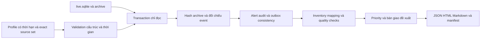

# Thiết kế v6 — Tài sản, chất lượng telemetry và bàn giao dịch vụ

Ngày hoàn thiện: 09/10/2026. Tôi bổ sung v6 vào hệ thống đã có acquisition, detection, case workflow, packet analysis và recovery. Phần mới dùng Python standard library, đọc `live.sqlite` và acquisition archive của workspace operational; không yêu cầu thêm agent/backend.

## 1. Vấn đề vận hành và phạm vi

Hàng đợi alert chỉ phản ánh policy đã match trên dữ liệu nhận được. Nó chưa trả lời tài sản nào thiếu dữ liệu, bản ghi có đủ field để điều tra hay ai chịu trách nhiệm xác minh dịch vụ. Tôi thêm báo cáo hiện trạng để đưa những câu hỏi đó vào hồ sơ bàn giao.

Tôi giữ observation, telemetry issue và incident verdict độc lập. Process thiếu ParentImage tạo quality issue. Heartbeat cũ tạo diagnostic theo collection scope. Chưa đủ để kết luận process độc hại hoặc sensor trên từng host dừng chạy.

Readiness chạy theo lần gọi CLI. Chưa có continuous monitor, CMDB sync, ticket integration hoặc endpoint action. Owner, incident lead, reviewer và criticality là context do người vận hành khai báo. Hệ thống kiểm cấu trúc/hash; chưa xác thực người khai báo hoặc quyền phê duyệt.

## 2. Luồng xử lý và snapshot

SQLite dùng `mode=ro`, `query_only=ON` và một transaction đọc. Profile đọc một lần, giới hạn byte, reject duplicate JSON key rồi hash đúng byte nhận được. Archive giữ ở workspace; báo cáo nằm ngoài workspace, dùng destination mới.

WAL-mode SQLite có thể tạo SHM hoặc WAL chưa có frame để phối hợp reader. Vì vậy kiểm chứng chỉ đọc so hash database chính, archive và nonempty WAL; không tuyên bố mọi byte/filesystem metadata bất biến. Readiness không sửa bảng event/alert/audit/outbox/cursor.

`as_of` phục vụ freshness/window/overdue/context validity. Snapshot vẫn là **state hiện tại lúc đọc**, kể cả alert đã cập nhật sau một thời điểm lịch sử. Đây không phải time-travel database. Mốc cố định dùng cho scenario; operational assessment mới dùng UTC hiện tại.

## 3. Hợp đồng context và nguồn

[Profile đã chạy](../evidence/service/context.json) là ví dụ đầy đủ với inventory/reviewer tự dựng.

| Nhóm | Trường và validation |
| --- | --- |
| Nhận diện | `schema_version: 1`, `id`, `kind` synthetic/private_host |
| Review | `reviewed_by`, `reviewed_at`, `valid_until`, `collection_reason`; timezone bắt buộc; hiệu lực tối đa 366 ngày |
| Nguồn | 1–50 scope; ID duy nhất; tập source SHA-256 chính xác, không trùng |
| Tài sản | 1–100 asset; ID duy nhất; 1–10 host alias; owner, incident lead, service, classification, criticality |
| Telemetry | 1–200 requirement; asset/scope tồn tại; provider/channel/Event ID, required fields và ngưỡng |

Host alias không được ánh xạ hai asset, kể cả khác chữ hoa. Mỗi asset phải có ít nhất một requirement; thiếu policy bị reject thay vì được coi đủ coverage. Windows asset mapping không tự suy ra owner từ IP.

Chuỗi context tối đa 500 ký tự, có nội dung, không ASCII control/newline. Required field có dạng `event_data.FieldName`; threshold là integer, không boolean. Profile giới hạn 256 KiB. Key thừa chưa dùng không tạo quyền/action mới.

Tập batch hash trong từng scope phải **bằng** tập đã review. Scope chưa có dữ liệu khai báo `source_sha256: []` để assessment thể hiện missing coverage; đây không phải auto-approval nguồn tương lai. Kind batch/observation phải khớp profile.

Native worker tiếp nhận batch mới làm profile cũ fail. Người vận hành review acquisition inventory, reason, classification, expiry rồi tạo profile mới. Không có wildcard hoặc thao tác đọc DB và tự duyệt toàn bộ nguồn. Tôi chọn phạm vi hồ sơ rõ, đổi lại profile tĩnh không dùng cho continuous monitoring.

## 4. Kiểm chứng trước suy luận

Selected observations giới hạn 50.000. Số record phải bằng tổng batch accepted; source hash thuộc approved set, physical line dương. Archive phải nằm trong acquisition directory, tối đa 16.000.000 byte/file và 64 MiB tổng byte đọc theo batch.

Tôi hash lại toàn bộ archive và đối chiếu normalization tại dòng tham chiếu với identity/event data/original object trong DB. Byte/newline bị sửa, row khác nguồn hoặc line không tồn tại khiến báo cáo fail trước publication. Skipped overlap vẫn anchor tới acquisition đầu tiên accepted; không buộc mọi dòng archive trở thành event mới. Record ID đơn lẻ không đủ làm identity.

Alert verifier kiểm full audit chain/current state. Evidence UID nằm trong snapshot; hash/line/host/provider/channel/Event ID phải khớp observation đã verified. Outbox phải đủ record, có state hỗ trợ và scope/kind tương ứng. Missing outbox bị reject thay vì trình bày queue rỗng như kết quả tốt.

Snapshot SHA-256 hash canonical profile, selected original objects/acquisition references/received time, collector metadata, queue summary và full verified alert state. Context có hash riêng theo bytes. Các hash giúp nhận ra divergence; không phải authenticated custody, signature hoặc chứng minh collection đầy đủ ngoài phạm vi.

## 5. Quality checks

Record match khi đúng asset, scope, provider, channel và Event ID. Provider/channel so không phân biệt chữ hoa. Sai channel dù đúng ID được giữ unmatched; không tăng coverage của channel đúng.

| Chỉ số | Cách tính | Giới hạn diễn giải |
| --- | --- | --- |
| observed_total | Mọi record đúng policy trong selected collection | Chưa đại diện toàn activity host |
| in_window | as_of-window ≤ event time ≤ as_of | Future event không tăng count hiện tại |
| latest_event_age_seconds | Tuổi event nonfuture mới nhất | Event cũ chưa chứng minh collector dừng |
| missing_event_ids_in_window | ID yêu cầu chưa xuất hiện trong window | Audit có thể đang chạy nhưng không có activity |
| missing_fields | Field absent/rỗng trên toàn approved policy records | Không chỉ window; không tự ghép từ event khác |
| late_records | received-event > ngưỡng lag | Replay log lịch sử cũng nhận trễ; chưa phải backend outage |
| future_records | event > as_of+120 giây | Cần đối chiếu clock/timezone, chưa biết bên nào sai |
| negative_received_lag | received < event | Giữ riêng; không tăng attack confidence |
| Collector checks | Updated age, gap count, last error theo scope | Chưa chứng minh sensor từng host |

Heartbeat expectation chỉ áp dụng khi `max_collector_age_seconds` khác null. Có expectation nhưng không row được `chưa_có_heartbeat`. Fresh heartbeat không xóa missing-field/activity issue. Một record có thể đồng thời late/incomplete; issue count không phải incident count.

Anchor sample tối đa năm UID/source hash/line/time mỗi requirement. JSON không nhúng mọi raw host message; nguồn đầy đủ vẫn ở workspace để truy lại. Display sample không giới hạn số event được kiểm chứng.

## 6. Priority và quyết định

Critical/high asset có active alert hoặc gap được `ưu_tiên_review`. Asset thấp hơn có gap được `cần_bổ_sung_telemetry`; chỉ active alert được `review_theo_hàng_đợi`; không cả hai được `chưa_có_lead_đang_mở`. Trạng thái cuối chưa chứng minh tài sản an toàn.

Sort criticality giảm dần rồi ID. Đây là thứ tự làm việc, không phải calibrated risk score. Context thay đổi không sửa alert severity/owner/revision/state/verdict/audit. Review target `due` là policy interval hiện hữu, không measured doanh nghiệp SLA.

Multi-asset alert hiển thị ở các asset liên quan và có cờ ambiguity. Headline active_alerts đếm unique alert toàn snapshot; cộng các dòng asset có thể lặp. Unmapped host giữ observations/alert IDs, không tự tạo owner/priority.

Biên bản giữ service/owner/incident lead khai báo, open alert IDs, gaps và hai nhóm đề xuất: bảo toàn/bổ sung chứng cứ; xác minh chủ dịch vụ trước containment. Mỗi nhóm có owner dự kiến, approval, impact, rollback, verification. Chưa gửi notification/ticket hoặc xác thực người có thẩm quyền. Alert đóng giữ decision cũ; readiness verdict riêng luôn `chưa_kết_luận`.

## 7. Output và riêng tư

Bundle có readiness.json, index.html, ban-giao.md và manifest.json. Manifest hash ba nội dung và giữ context/snapshot identity. Render đủ staging rồi rename destination mới. Permanent failure không để final report. PermissionError Windows retry ngắn sáu lần; không phải multi-publisher protocol.

Private kind yêu cầu workspace/output trong private cache hoặc ignored data/local. Profile synthetic không export selected private scope; unrelated private scopes không xuất hiện. Filesystem owner vẫn có thể tự copy/đổi classification, guard không thay access control/retention.

HTML tiếng Việt có bốn tab, asset search và bàn giao có nhãn dễ đọc. DOM dùng textContent; embedded JSON escape < > &, CSP đóng external connection/form/base. Không cần CDN. Markdown escape context để owner text không tạo HTML/link. Technical field keys giữ nguyên schema để đối chiếu artifact.

## 8. Kiểm chứng và failure path

24 test mới kiểm exact summary/read-only repeat, field/clock/channel, no-events, heartbeat, source approval, archive/DB/original JSON/source-reference corruption, audit tamper, missing outbox, closed-alert preservation, priority isolation, expiry/timezone/caps, duplicate alias/missing policy, private boundaries, unmapped alert, XSS và failed publication.

Local 3.11.5/3.12.14 đều pass toàn bộ 151 test. Validator tạo fixture, thực thi detector và readiness, so persistent bytes và manifest. Kết quả hai asset/12 event/một unmapped host/năm requirement/bốn cần review/hai active alert. [Artifacts](../evidence/service/README.md).

Development có ba failure đáng ghi: so mọi file fail vì reader tạo coordination file; tôi kiểm tra và định nghĩa phép hash với boundary rõ. Corruption test bị FK chặn trước readiness; test hiện dùng connection riêng để dựng DB hỏng, production ingest vẫn giữ FK. Publication bị transient lock Windows; bounded retry xử lý, permanent-lock regression vẫn không để final output.

## 9. Phần chưa triển khai

Chưa có authenticated per-host heartbeat, đọc audit policy/config trực tiếp, CMDB API, fleet registration, distributed watermark, lịch sử version mọi database state, ticket integration, auto source approval, RBAC/signature/remediation. Ngưỡng scenario chưa được calibrate từ production độc lập. Pass quality checker chưa chứng minh detection recall, endpoint an toàn hoặc nguồn đầy đủ ngoài collection.

Tôi giữ những giới hạn này trong hồ sơ vì chúng xác định người vận hành có thể dựa vào output tới đâu. v6 thêm bước kiểm tra dữ liệu và trách nhiệm dịch vụ vào implementation chạy được, với input/output và failure handling có thể kiểm tra.
