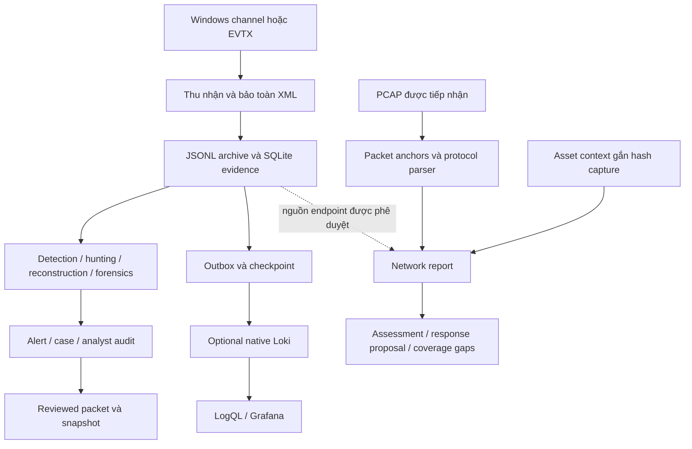
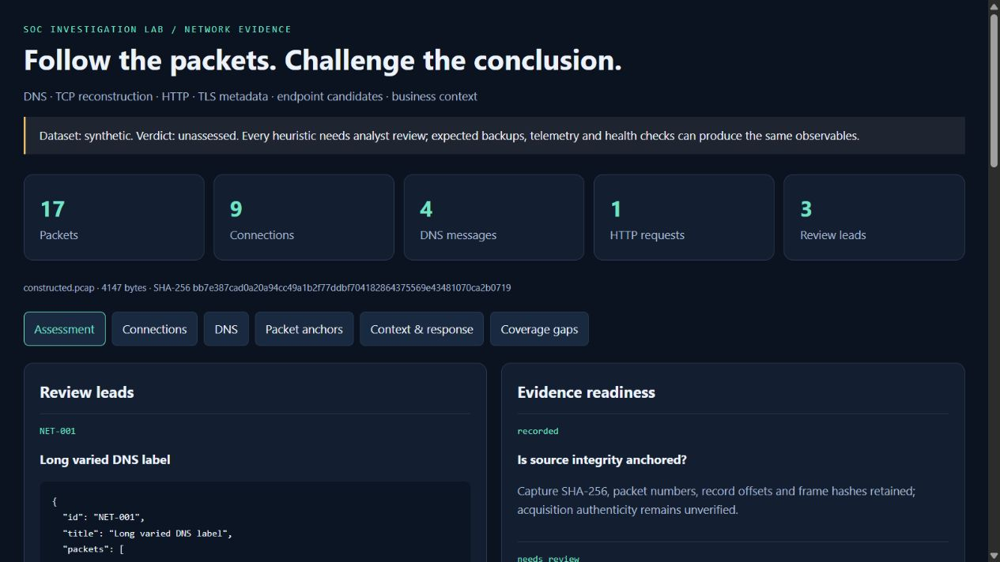
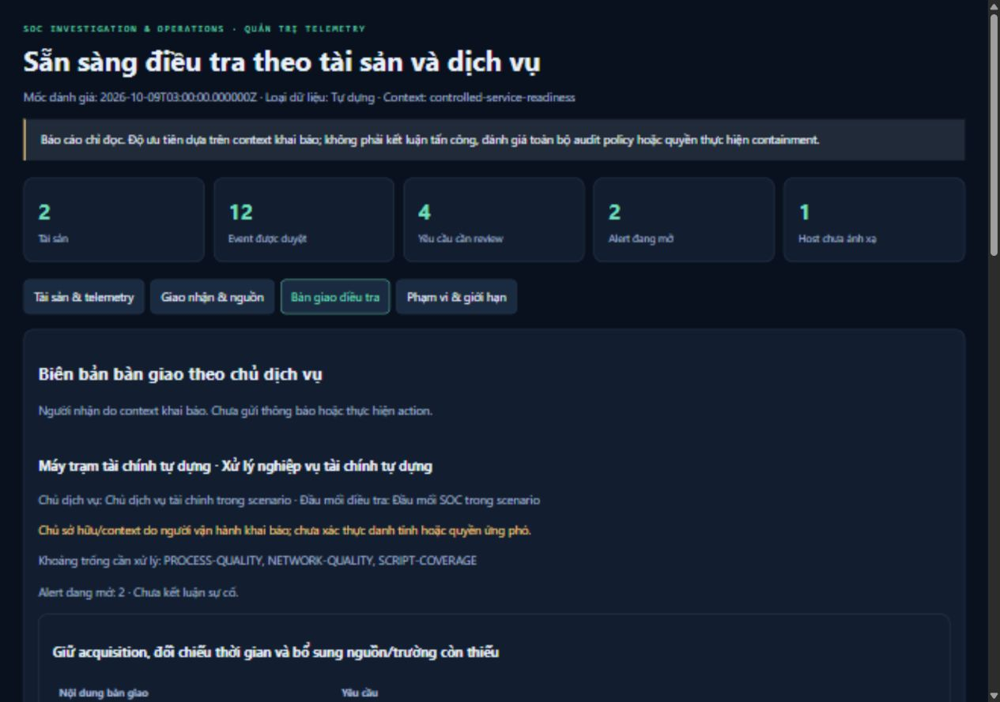

# SOC Investigation & Operations — Báo cáo dự án

**Phiên bản triển khai:** 6.0.0. **Ngày hoàn thiện bộ hồ sơ:** 09/10/2026. **Phạm vi:** hệ thống thu thập, điều tra và quản lý bằng chứng trên một workstation, với backend Loki/Grafana tùy chọn.

Trong dự án này, tôi xây dựng một luồng xử lý từ bản ghi được tiếp nhận đến quyết định điều tra có thể kiểm tra lại. Tôi chọn Windows telemetry và packet capture làm hai nguồn quan sát chính vì chúng trả lời những câu hỏi khác nhau: log endpoint mô tả danh tính, process và thao tác được ghi nhận; packet mô tả những byte và quan hệ giao thức xuất hiện tại vị trí capture. Việc ghép hai nguồn phải có điều kiện, thay vì coi cùng IP hoặc gần thời gian là đủ để kết luận.

Bộ hồ sơ này mô tả phần đã triển khai, những quyết định thiết kế, kết quả điều tra và các phép kiểm chứng đã thực hiện. Các dữ liệu công khai, dữ liệu tự dựng và thu thập thật trên máy được ghi rõ theo từng nguồn. Phần phát triển và phân tích ban đầu có sử dụng Codex; các kết quả không được trình bày như kinh nghiệm vận hành SOC doanh nghiệp hay sự cố sản xuất đã xử lý.

## 1. Bài toán và yêu cầu

### 1.1. Vấn đề cần giải quyết

Một hệ thống tìm từ khóa có thể tạo nhiều alert nhưng vẫn không tạo được hồ sơ điều tra đáng tin cậy. Ba vấn đề tôi tập trung xử lý là mất nguồn gốc bằng chứng, ghép nhầm các hoạt động độc lập và không giữ được trạng thái khi luồng xử lý gặp lỗi.

Ở mức bằng chứng, một dòng timeline thiếu XML gốc hoặc vị trí trong file khiến nhận định khó kiểm tra. Ở mức tương quan, username giống nhau không đồng nghĩa cùng domain, session hoặc process. Ở mức vận hành, checkpoint tiến trước khi lưu event có thể làm mất dữ liệu; gửi HTTP thành công nhưng chưa ghi acknowledgment tạo khả năng gửi lặp; export ghi dở có thể bị hiểu là hồ sơ hoàn chỉnh.

Tôi thiết kế hệ thống để những tình huống này có trạng thái và đầu ra rõ ràng. Một lead có thể thiếu bằng chứng. Một queue có thể đang chờ retry. Một cursor có thể có gap. Một capture có thể có hai process ứng viên. Những trạng thái này là một phần của kết quả, không bị che bằng một dashboard chỉ hiển thị đường chạy thành công.

### 1.2. Yêu cầu chức năng

| Mã | Yêu cầu | Cách triển khai |
| --- | --- | --- |
| FR-01 | Thu nhận Windows event và giữ thông tin gốc | Native EVTX export; polling các channel hiện hữu; lưu original XML/object |
| FR-02 | Truy lại được event từ finding | Source SHA-256, physical line, event UID, provider/channel/record ID |
| FR-03 | Đánh giá log bằng policy có thể đọc | Chín event rule, ba giả thuyết authentication offline, một policy chuỗi đa bước |
| FR-04 | Điều tra quan hệ session/process | Scope phê duyệt nguồn, host/domain/session GUID/process GUID và ancestry quan sát được |
| FR-05 | Phân tích PowerShell mà không thực thi | Ghép fragment, giữ missing/conflicting parts, bounded decode và parse-only AST |
| FR-06 | Vận hành thu thập theo chu kỳ | Cursor có fingerprint, transaction evidence/checkpoint/outbox, rolling event-time detection |
| FR-07 | Giao nhận có khả năng khôi phục | Persisted payload, lease, retry/backoff, dead letter, redrive có lý do |
| FR-08 | Ghi nhận quyết định analyst | Owner, revision, rationale, verdict, state transition và audit chain |
| FR-09 | Xuất và khôi phục hồ sơ | Reviewed packet, manifest, exclusive publication, SQLite/archive snapshot và restore verification |
| FR-10 | Điều tra PCAP | Packet offset/hash, TCP reassembly, DNS/HTTP/TLS metadata và diagnostic |
| FR-11 | Bổ sung endpoint/business context có kiểm soát | Exact source scope; tuple/protocol/time candidates; capture-bound asset inventory |
| FR-13 | Đánh giá dịch vụ, quality và bàn giao | Snapshot chỉ đọc, inventory, exact source/time-bound profile, quality checks, handoff |
| FR-12 | Có thể kiểm chứng độc lập | CI đa OS/interpreter, native Loki responses, dpkt cross-check, inventory checksum |

### 1.3. Yêu cầu phi chức năng và phạm vi bàn giao

Máy mục tiêu có 8 GB RAM nên tôi giữ core ở Python standard library và SQLite, không yêu cầu VM, Docker, message broker hay cluster. Loki/Grafana là process native tùy chọn, có thể dừng độc lập. SQLite đang ghi liên tục được đặt trong private cache của Windows thay vì thư mục OneDrive chứa source.

Tôi đặt giới hạn đầu vào và yêu cầu output mới thay vì ghi đè kết quả đã review. Event import sai định dạng phải rollback; reconstruction vượt giới hạn phải fail rõ; HTTP write phải ở loopback; private collection không đi vào backend delivery công khai. Đây là các ràng buộc được triển khai, không phải cam kết vận hành ở mọi tải hoặc mọi filesystem.

Phạm vi bàn giao gồm source, policy, scripts triển khai/kiểm chứng, giao diện localhost, tám báo cáo điều tra và bằng chứng kiểm thử. Hệ thống không bao gồm agent EDR, live packet sensor, multi-user IAM, autonomous containment hay dịch vụ SOC hoạt động 24/7. Các giới hạn này được đưa vào thiết kế và nghiệm thu, không chỉ ghi ở cuối báo cáo.

## 2. Kiến trúc tổng thể

### 2.1. Hai đường xử lý

Đường Windows có cả chế độ retrospective và polling theo chu kỳ. Retrospective giữ các collection độc lập trong database/bundle riêng. Operational path duy trì evidence, observations, outbox, cursor và alerts trong workspace có thể tiếp tục sau khi process dừng.

Đường network xử lý capture offline và tạo bundle độc lập. Nó có thể đọc endpoint database để tìm ứng viên, nhưng không tự nhập PCAP vào live alert queue, không lấy kết quả network làm verdict của Windows case và không nối các public sample thành một incident chung.

### 2.2. Thành phần và quyền sở hữu dữ liệu

| Thành phần | Dữ liệu sở hữu | Vai trò |
| --- | --- | --- |
| Collector/exporter | Channel cursor, original XML, acquisition metadata | Đọc nguồn; phát hiện reset/gap; không bật policy hay thực thi command trong log |
| Evidence store | Sources, events, original objects | Chuẩn hóa trường để truy vấn; giữ nguyên đối tượng tiếp nhận |
| Detection/reconstruction | Finding, graph, policy/source references | Đưa ra observable và relationship có điều kiện |
| Operational store | Observations, batches, outbox, collectors, detection runs, alerts/audit | Duy trì trạng thái sau lỗi hoặc restart |
| Case store | Case snapshots, evidence anchors và audit | Ghi nhận quyết định riêng với dữ liệu nguồn |
| Loki/Grafana | Stream, query response, dashboard | Backend quan sát/truy vấn; không phải engine policy Python |
| Network bundle | network.json, index.html, manifest.json | Hồ sơ packet và context; original PCAP giữ riêng |
| Published evidence | Selected response, ảnh thật, checksum | Căn cứ kiểm tra kết quả đã công bố |

Các chi tiết module, port và trust boundary được đặc tả trong [ARCHITECTURE.md](ARCHITECTURE.md). Quy trình thao tác thống nhất nằm ở [OPERATIONS.md](OPERATIONS.md).

## 3. Nguồn dữ liệu và chính sách bằng chứng

### 3.1. Phân loại nguồn

Tôi sử dụng public historical EVTX để phân tích các tình huống có log gốc, constructed records để kiểm tra các nhánh mà public sample thiếu, và native host collection để xác minh collector hoạt động với channel thật. Ba loại này không thay thế nhau.

| Nhóm | Quy mô được ghi nhận | Ý nghĩa |
| --- | --- | --- |
| Ba public Windows primary collections | 8 + 3,561 + 3 = 3,572 event | Quan sát lịch sử của các dataset độc lập |
| Public credential supplement | 295 event | Collection riêng; không ghép vào authentication primary |
| Hai constructed Windows primary collections | 4 + 2,511 = 2,515 event | Context/reconstruction validation; 2,500 background records là noise tự dựng |
| Operational reliability input | 19 event qua hai batch, một overlap | Kiểm tra delivery/detection/workflow; không cộng vào corpus historical |
| Hai public PCAP | 43 + 38 = 81 packet | HTTP/DNS protocol sample, không có nhãn malicious intent |
| Constructed network input | 17 packet và hai endpoint event | TCP ambiguity/context validation; không phát traffic hay thực hiện backup |
| Native host collection đã ghi nhận | 60 event: 21 System, 39 PowerShell | Thu thập thật hữu hạn, XML giữ riêng; không phải 60 incident |

Năm Windows primary cases có 6,087 event. Tính supplement riêng, tổng Windows corpus là 6,382 event, gồm 3,867 public và 2,515 constructed. Tôi không dùng tổng này để mô tả một chiến dịch, một số lượng alert hay khả năng xử lý lớn.

Catalog EVTX lưu upstream repository, pinned commit, path, size và SHA-256. Network catalog lưu URL gốc, exact official redirect URL, size/hash và expected protocol counts. Original third-party files được tải vào ignored local storage, không phân phối lại trong repo. Dataset attribution nằm ở [data/catalog.json](../data/catalog.json), [data/network-catalog.json](../data/network-catalog.json) và từng case.

### 3.2. Danh tính event và observation

Evidence import tính SHA-256 trên byte của file JSONL và tạo `event_uid` từ source hash cùng physical line. Đây là tham chiếu vật lý: cùng nội dung được serialize khác có thể tạo source hash khác. Original EVTX hash là căn cứ ổn định cho acquisition download; export manifest ghi hash của bản JSONL thực sự đã dùng.

Operational collection bổ sung observation fingerprint dựa trên scope, dataset kind, host, channel, provider, record ID, timestamp, event fields và XML gốc khi có. Poll provenance không làm thay đổi observation identity. Nhờ vậy, record xuất hiện ở hai poll chồng lấn không trở thành hai observation mới; record ID được tái sử dụng với nội dung/thời gian khác vẫn là observation khác.

Tôi không gọi đây là xác thực nguồn. Hash kiểm tra byte so với một tham chiếu được giữ lại; nó không chứng minh event được sensor tin cậy thu nhận, không chứng minh đủ coverage và không ngăn người có toàn quyền filesystem viết lại toàn bộ hồ sơ.

### 3.3. Timestamp và trường gốc

Timeline Windows dùng `System/TimeCreated` và chuẩn hóa UTC ở độ chính xác microsecond. Precision gốc và `EventData.UtcTime` vẫn ở XML/original object. Equal timestamp được sắp ổn định theo source hash/line, nhưng thứ tự đó không được coi là causal order.

Một bằng chứng quan trọng là case 001: network payload UtcTime khác System time nhiều giờ. Tôi giữ discrepancy và không tự sửa bằng giả định timezone. Process GUID vẫn hỗ trợ association; chronology network chính xác và elapsed time không được suy ra từ collection này.

PCAP timestamp giữ nanosecond representation theo precision của file. Association DNS/connection dùng cửa sổ có giới hạn; TCP DNS stream có thời gian gần đúng nên không tham gia timing join DNS-to-connection. Cross-source endpoint matching có ±2 giây, nhưng clock agreement và vị trí capture vẫn phải được xác minh khi diễn giải ứng viên.

## 4. Thu thập và vận hành bền vững

### 4.1. Collector

Collector đọc các channel hiện hữu: System, Security, Sysmon Operational và PowerShell Operational khi session có quyền. Nó không cài Sysmon, không bật audit policy, không xóa log và không thay đổi bảo vệ endpoint.

Lần đầu lấy recent bounded slice, mặc định 20 record. Các poll sau lấy record sau committed EventRecordID theo thứ tự tăng, tối đa 200 record/poll. Cursor giữ fingerprint XML của boundary record. Latest ID giảm, boundary đổi nội dung hoặc boundary biến mất trong retained range sẽ tạo reset/gap diagnostic. Cursor thấp hơn retained range cho thấy khả năng rollover mất dữ liệu.

Khi cần bootstrap lại, collector chỉ lấy recent slice và tăng gap counter. Nó không giả vờ tái tạo được lịch sử đã overwrite. Lỗi channel giữ cursor cũ và ghi last error; queue rỗng do không đọc được channel không được coi là máy an toàn.

### 4.2. Transaction và crash boundary

Archive byte được viết/flushed trước. Accepted evidence, observation identity, cursor và outbox entry sau đó commit trong một SQLite transaction. Nếu crash trước commit, có thể còn archive không được tham chiếu; committed cursor không tiến trước phần evidence/queue tương ứng.

Import malformed, oversized hoặc vượt capacity được từ chối và không tiến checkpoint. Offline import cũng rollback toàn bộ file nếu một nonblank line sai. Byte-identical import là idempotent. Blank line không làm đổi số physical line được dùng để truy event.

Đây là điểm khác biệt giữa lưu một file log và xây dựng ingestion có ràng buộc trạng thái. Tôi kiểm tra failure path chứ không chỉ kiểm tra tổng event sau một lần chạy thành công.

### 4.3. Outbox và delivery semantics

Payload cùng arrival timestamp được lưu trước HTTP request và giữ nguyên khi retry. Label backend giới hạn ở job/scope/kind; original event time, UID và nguồn ở JSON payload. Native private-host records đi vào `held_private`; đường delivery đã triển khai không có switch gửi chúng tới Loki.

Worker claim tối đa 250 due record trong transaction ngắn, gắn lease token rồi nhả transaction khi gọi HTTP. Lease hết hạn sau 180 giây. Acknowledgment chỉ cập nhật những row thuộc lease đó. Transient failure dùng exponential backoff lưu trong database, trần 300 giây. Sau tám delivery cycle thất bại, record vào `dead_letter` cùng payload/evidence; redrive yêu cầu actor label và reason, đồng thời ghi maintenance record.

Semantics là **at-least-once**. Backend đã nhận nhưng worker chết trước acknowledgment có thể dẫn tới gửi lặp. Tôi không gọi là exactly-once và không dùng HTTP 2xx như bằng chứng rằng mọi consumer đã xử lý xong. UID cho phép kiểm tra tập record ở query path, trong khi payload vẫn là bản persisted trước retry.

### 4.4. Detection theo chu kỳ

Live scheduler chạy chín event rule và AUTH-001. Authentication state có thể nối qua batch boundary trong cùng collection scope. Match vẫn giữ host, domain-qualified account, source IP và logon type; independent scopes không bị ghép.

Rolling event-time window mặc định 600 giây, có future-clock allowance 120 giây. Alert identity gồm collection scope, finding identity và policy digest. Rule thay đổi có thể tạo lead mới, còn snapshot cũ được giữ. Trên 10,000 record/window, evaluator abort thay vì công bố partial success.

Event đến quá muộn vẫn được lưu nhưng nằm ngoài window thì scheduler không evaluate. Không có distributed watermark hay replay tự động mọi record cũ. Offline AUTH-002/003 và reconstruction được giữ là thao tác retrospective rõ ràng, không mô tả như feature live đã chạy.

## 5. Detection, hunting và forensic reasoning

### 5.1. Policy Windows

| Policy | Observable chính | Giới hạn khi diễn giải |
| --- | --- | --- |
| WIN-001 | Encoded-command switch trong process PowerShell | Chưa xác định nội dung decoded hay việc thực thi thành công |
| WIN-002 | Execution-policy bypass switch | Switch có thể xuất hiện trong workflow quản trị hợp lệ |
| WIN-003 | Certutil file decoding | Decode không tự chứng minh file độc hại |
| WIN-004 | Mshta remote URL/inline script | Cần đối chiếu process/network/artifact và authorization |
| WIN-005 | Scheduled task event chứa script interpreter | Registration không chứng minh task đã chạy |
| WIN-006 | Run-key value hướng tới script interpreter | Cần registry/value/content/change context |
| WIN-007 | Security audit log clear | Cần maintenance/authorization và collection context |
| WIN-008 | Schtasks creation command hướng tới interpreter | Command observation không tự chứng minh registration hoặc execution |
| WIN-009 | Download/evaluate text trong script block | Substring không phân biệt quoted data và executable syntax |

Executable policy là custom JSON với `equals`, `contains_any`, `endswith_any`, mỗi condition đều phải match và missing field làm condition fail. Provider/channel được giữ cùng event ID để tránh nhầm các số ID giữa nguồn. Rationale, suggested severity, false positives và limitations được lưu cạnh logic.

AUTH-001 cần failures rồi success trong cửa sổ và identity policy đã định nghĩa. AUTH-002 tạo lead cho failure-only network-logon burst: mặc định ít nhất 10 record trong 5 phút, cooldown 5 phút. AUTH-003 kiểm tra distinct targets trong explicit credential use; event 4648 không được gán nghĩa authentication failure. CHAIN-001 đòi các bước thất bại/thành công, risky process gắn session, process-linked initiated network và task-creation descendant trong approved source set.

Ba Sigma rule là biểu diễn riêng và đã parse bằng pySigma. KQL/SPL ở thư mục query là reference translation; không có kết quả chạy trên Sentinel/Splunk để đưa vào hồ sơ. SQLite hunts và Loki/LogQL mới là các query path đã thực thi.

### 5.2. Identity reconstruction

Tôi không lấy username/time làm bằng chứng đủ cho session/process link. Graph giữ host, domain-qualified account, logon GUID hợp lệ khác zero, ProcessGuid và ParentProcessGuid. Conflicting creation records có thể vô hiệu một causal join; missing parent được ghi là missing thay vì tạo node/edge suy đoán.

Scope manifest phê duyệt exact source hash set và collection reason. Điều này cần thiết cho case có Security và Sysmon nhưng không cho phép nối hai log công khai độc lập chỉ vì cùng account. Finding chuỗi là lead cần review; thiếu chuỗi không tự sinh verdict benign.

Index identity/time, session và ancestor/task thay thế việc quét lại toàn bộ event cho từng candidate. Binary search giới hạn failure window. Graph input cap 100,000 event được kiểm tra trong lúc đọc trước sorting/materialization, tránh tiêu thụ một iterable quá lớn rồi mới từ chối.

### 5.3. Threat hunting

Tám hunt chạy trên năm primary collection và supplement riêng, tạo 48 execution record có SQL/hash, returned rows, row limit và caution. Nội dung gồm parent-child distribution, process GUID/network pivot, failed-logon identity/IP/reason, task registration, script block, explicit credentials/distinct targets, audit-clear và registry-write telemetry.

Một hunt trả 0 row được ghi là không có observation trong scope truy vấn. Ví dụ HUNT-08 không có event 13 ở sáu collection, nên không thể kết luận registry persistence không tồn tại. Rarity cũng chỉ là rarity trong collection nhỏ, không phải enterprise baseline.

[HUNT_NOTEBOOK.md](HUNT_NOTEBOOK.md) giải thích kết quả theo collection. [hunts.json](../evidence/operations/hunts.json) giữ SQL và returned rows để kiểm chứng.

### 5.4. PowerShell forensics

Fragment reconstruction nhóm script block theo identity và message parts, phân biệt complete, missing và conflicting. Nó không ghép tùy ý những chuỗi có vẻ cùng nội dung. Bounded Base64 decoding tạo output phục vụ static inspection; không gọi evaluator để chạy payload.

Native AST inspection dùng parser, không execute script. Trong public case 003, chuỗi download/evaluate nằm trong quoted text; parse-only result không có command/member-invocation AST của biểu thức đó. Module record hỗ trợ việc in nó ra. Vì vậy tôi giữ verdict execution chưa được chứng minh dù WIN-009 match.

Đây là phân tích của một excerpt, không phải chứng minh toàn bộ runspace vô hại. Logging coverage, complete parts, code ngoài collection và context thực thi vẫn là giới hạn. Kết quả/constraints chi tiết nằm ở [POWERSHELL_FORENSICS.md](POWERSHELL_FORENSICS.md).

## 6. Điều tra packet và context

### 6.1. Parser và packet anchors

Parser hỗ trợ classic PCAP 2.4 little/big-endian và micro/nanosecond precision, Ethernet tối đa hai VLAN tag, raw IPv4 và Linux cooked v1. Capture cap 32 MiB, 50,000 packet, 2,000 flow; stream span tối đa 128 KiB. PCAPNG bị từ chối rõ; IPv6, IP fragmentation và unsupported transport đi vào diagnostic/gap.

Mỗi packet giữ source hash, packet number, PCAP record offset, captured/wire length và frame SHA-256. Packet extraction yêu cầu approved source hash và xác minh byte frame. Trên constructed capture, packet 6 có record offset 570; frame hash bắt đầu `08ed155b9dbe719d`. Browser inspection và original-byte extraction cùng trỏ về frame đó.

Original PCAP phải giữ riêng. JSON/report cùng hash không khôi phục được acquisition file, không xác thực sensor và không phản ánh packet drop mà capture không ghi nhận.

### 6.2. TCP, DNS, HTTP và TLS

TCP reassembly dùng sequence number, có xử lý wrap, segment đến sai thứ tự và exact retransmission. Conflicting overlap hoặc gap suppress application inference. SYN hỗ trợ session separation; tuple reuse không có SYN quan sát được có thể vẫn ambiguous. Byte counter của captured traffic không được dùng như unique application transfer volume.

DNS parser giới hạn compression traversal, phát hiện pointer cycle/truncation và giữ question/type/class/rcode. Query-response association cần ID, question, reverse tuple, flow và time; nhiều ứng viên không bị ép thành một answer duy nhất. CNAME/A answer có thể đề xuất connection tiếp theo của cùng captured client trong TTL, trần 300 giây. Shared address, cache và NAT ngăn biến association đó thành hostname/process identity proof.

HTTP/1 parsing bắt đầu tại reconstructed stream boundary, tối đa 100 request/direction và dùng Content-Length để không tìm nhầm request-looking text trong body. Duplicate/ambiguous Host, Content-Length/Transfer-Encoding và invalid field bị từ chối. Chunked body unsupported/incomplete; response acceptance không được phân tích. Complete body có hash nhưng không được gắn nhãn exfiltration chỉ từ kích thước.

TLS inspection chỉ lấy SNI từ supported first ClientHello trong một TLS record. Không có decryption, certificate validation, HTTP/2 hay JA3. Tên do client gửi không chứng minh server identity và không tiết lộ nội dung application đã mã hóa.

### 6.3. Network review policies

| ID | Điều kiện đã triển khai | Giả thuyết thay thế được giữ |
| --- | --- | --- |
| NET-001 | DNS label dài ít nhất 40 ký tự, Shannon entropy ít nhất 3.5 bits/character | Telemetry ID, CDN/cache key, dữ liệu encode hợp lệ |
| NET-002 | POST/PUT/PATCH khai báo body ít nhất 1,024 byte | Backup, upload ứng dụng hoặc chuyển dữ liệu chưa được phê duyệt |
| NET-003 | Ít nhất sáu SYN start trong khoảng ít nhất 120 giây, interval CV không quá 0.1 | Health check, polling agent hoặc beacon-like attempt |

Đây là threshold policy để tạo review lead. Nó không có independent malicious/benign network accuracy benchmark. SYN start không tương đương TCP handshake thành công; long label không đủ chứng minh DNS tunnel; upload không đủ chứng minh đánh cắp dữ liệu.

### 6.4. Endpoint attribution

Cross-source pivot cần manifest phê duyệt đúng PCAP hash và toàn bộ endpoint-source hash set cùng reason. Candidate chỉ lấy Sysmon Operational event 3 đúng provider/channel, protocol, IP/port tuple và cửa sổ ±2 giây. Multiple candidates giữ nguyên trong report; không chọn executable có tên thuận với câu chuyện.

Case 007 chủ động chứa `backup.exe` và `unverified.exe` cùng khớp tuple/time nhưng khác ProcessGuid. Không có process-creation evidence để chứng minh origin. Việc xác minh cần capture vantage, NAT/proxy, clock, ProcessGuid creation, actual executable hash/signature và authorization record.

### 6.5. Asset context và proposed response

Context inventory phải gắn exact capture hash. Asset có unique IP, name, owner, service, classification và criticality. High/critical asset chuyển associated lead sang `review_first`; đây là priority từ declared inventory, không phải confidence hoặc incident severity.

Readiness tách integrity references, collection gaps, ownership, endpoint candidates, business authorization và response authority. Mỗi đề xuất xử lý ghi owner, required approval, impact, rollback và verification. Hệ thống không chạy firewall rule, disable account hay isolate host.

Ví dụ với upload nghi vấn trên máy finance: giữ capture/log trước, xác minh backup change và destination owner, xác định process, rồi mới cân nhắc restriction có phạm vi. Một restriction sai có thể làm gián đoạn backup hoặc kỳ xử lý nghiệp vụ. Report giữ cả lý do cần review lẫn bằng chứng còn thiếu trước hành động đó.

## 7. Hồ sơ điều tra đã hoàn thành

### 7.1. CASE-001 — Mshta và scheduled task

Tám public Sysmon record trên IEWIN7 hỗ trợ chuỗi `cmd → rundll32 → mshta → schtasks` qua observed parent GUIDs, network event gắn mshta GUID và task-file artifact. Tôi đánh giá pattern cần escalation vì remote-content execution lead đi cùng recurring-task request; đây là assessment trên historical dataset, không phải hành động xử lý một production incident.

Collection không có Security 4698, task operational log, task XML hay payload content. Task file củng cố registration hypothesis nhưng chưa chứng minh task định kỳ đã execute. Network timestamp discrepancy cũng ngăn kết luận elapsed time chính xác. [Báo cáo gốc](../cases/001-mshta-scheduled-task/report.md) giữ timeline, GUID và evidence reference.

### 7.2. CASE-002 — Authentication failures và supplement độc lập

Primary collection có 3,561 Security 4625 trong khoảng 163 giây, trong đó 3,560 target Administrator. Aggregate giữ domain/account/IP/logon type/SubStatus; dominant row có 3,558 bad-password failures. Không có 4624 trong file nên account takeover chưa được chứng minh.

AUTH-001 không match là đúng với hypothesis failures-then-success, nhưng bỏ qua observable failure-only burst. Tôi bổ sung AUTH-002 như lead riêng, có threshold/cooldown và all-event aggregate để tránh gọi 10 anchor record là toàn bộ số attempt.

Supplement 295 record gồm 294 explicit-credential observations và một audit-clear record; có 41 distinct domain-qualified target accounts. Nó được điều tra riêng, không dùng để dựng success hoặc password-spray outcome trong primary năm 2016. [Case report](../cases/002-authentication/report.md) ghi việc cần xác minh authorization, successful authentication và endpoint context.

### 7.3. CASE-003 — Download-looking text là dữ liệu

Ba public PowerShell record tạo một text-rule lead, nhưng script block giữ download/evaluate expression như quoted string và module record hỗ trợ output text. Parse-only native AST củng cố syntax interpretation. Tôi giữ download/execution verdict mở thay vì chuyển tên dataset hoặc keyword hit thành executed attack.

Giá trị của case là sự khác biệt giữa detector observable và forensic conclusion. [Báo cáo](../cases/003-powershell-string/report.md) giữ raw evidence và giới hạn excerpt.

### 7.4. CASE-004 — Context tuning không xóa bằng chứng

Bốn constructed observation kiểm tra baseline và exact context profile. Baseline có bốn finding; annotation giữ cả bốn, đánh dấu một expected-context match và còn ba review lead cho variant thay đổi context.

Path/command match không xác thực script content hiện tại. Tôi giữ limitation này cùng reason/change reference thay vì tạo allowlist tuyệt đối. [Báo cáo](../cases/004-context-tuning/report.md) mô tả positive/changed-context behavior.

### 7.5. CASE-005 — Chuỗi từ session đến task

Collection tự dựng có 2,511 event từ ba nguồn explicit-related, gồm 11 meaningful observation và 2,500 inert background record. Graph có ba process node, hai observed parent edge và một supported five-stage chain; event/auth analysis có bốn lead riêng.

Case workflow giữ chín initial anchors; browser review bổ sung Security 4698 thành anchor thứ mười ở revision 5. Hai export revision khác nhau thể hiện hai trạng thái review, không ghi đè packet cũ. Registration evidence vẫn không chứng minh task execution. [Case](../cases/005-multisource-chain/report.md) và [reviewed packet](../evidence/operations/reviewed-bundle/report.md) giữ quyết định và evidence snapshots.

### 7.6. CASE-006 — Public HTTP và DNS

HTTP capture có 43 frame, ba flow, hai DNS message và hai HTTP request. DNS query packet 13/response packet 17 hỗ trợ CNAME/A relationship tới một TCP connection sau đó. DNS capture độc lập có 38 frame/message qua tám flow. dpkt đối chiếu selected tuples/questions và hai complete single-packet HTTP request.

Tôi báo cáo protocol observations, không gán malicious intent và không nối hai capture với Windows cases. Không có heuristic match chỉ mô tả policy trên hai sample; thiếu asset/endpoint/acquisition context vẫn giữ verdict `unassessed`. [Báo cáo](../cases/006-public-network/report.md) ghi rõ decoded subset và gaps.

### 7.7. CASE-007 — Upload, telemetry và ambiguity

Mười bảy inert packet records chứa long DNS label, complete POST `/backup` body 2,480 byte, sáu SYN start cách nhau 30 giây và TLS SNI. Out-of-order segments cùng exact retransmission được tái dựng thành một request, ghi 70 repeated bytes thay vì tính thêm upload.

NET-001/002/003 đều tạo lead. Fictional finance asset context đưa chúng vào `review_first`, nhưng hai process candidates và missing authorization giữ verdict `unassessed`. Generator biết intended backup/monitoring activity; analyzer không nhận intended label làm bằng chứng để tự đóng case.

[Case report](../cases/007-network-context/report.md) có bảng observation/unsupported conclusion và proposed action với owner, approval, impact, rollback, verification. Không có backup thật, C2 thật, exfiltration thật hay containment đã thực hiện trong scenario này.

## 8. Analyst workflow, audit và bảo vệ giao diện

Alert/case đi theo state `new → triaged → investigating`, sau đó có thể `escalated` hoặc `closed`; escalation có thể quay về investigation. Đóng cần verdict/rationale hợp lệ. Live alert dùng `suspicious_activity`, `expected_activity`, `insufficient_evidence`; case workflow riêng dùng `confirmed_in_lab`, `expected_activity`, `insufficient_evidence`. Các verdict này là quyết định local được ghi nhận, không phải phán quyết tự động về production incident. Case đã link không tự nhận verdict của alert.

Optimistic revision ngăn stale client ghi đè quyết định mới. Actor label do người dùng khai báo, không có authenticated identity. Alert audit hash previous entry/full snapshot; case audit cũng được kiểm tra với current state. Closed review decision không sửa qua review API; linkage append không biến verdict cũ thành verdict mới.

Case creation và alert linkage ở hai database nên deterministic UUID từ alert ID hỗ trợ retry sau failure giữa hai commit. Retry tìm case đã giữ, xác minh scope/UID set rồi link lại. Đây là recovery logic cụ thể, không phải transaction phân tán.

Reviewed export có case/alert state, audit, retained original event objects, report và manifest. Destination mới, revision-specific filename và staged publication tránh ghi đè hoặc công bố ZIP dở. Hash chain cùng independent export anchor giúp phát hiện divergence; filesystem owner vẫn có thể viết lại/reseal, nên không được gọi là digital signature.

HTTP write chỉ chấp nhận exact loopback Host/port, matching Origin, per-process CSRF token và bounded JSON. Duplicate/ambiguous header, stale revision, invalid state và evidence ngoài collection bị từ chối. Event/analyst text dùng `textContent`; network HTML đóng external connections và giữ JSON không trở thành executable markup.

Các ràng buộc bảo vệ localhost browser flow, không thay thế authentication/RBAC/TLS/service isolation. Project không mở interface ra LAN/public Internet.

## 9. Recovery, kiểm chứng và kết quả

### 9.1. Snapshot/restore

Snapshot giữ SQLite backups, original batch archives và file-hash inventory. Database integrity và archive hashes được kiểm tra. Restore dùng workspace mới, exact inventory và path restrictions; private snapshot giữ trong private cache/ignored `data/local`.

Không chạy original và restored workspace như hai delivery agent song song. In-flight lease đợi expiry bình thường; uncertain remote acceptance vẫn at-least-once. Restore bị ngắt có thể để partial destination, nên operator giữ lại để kiểm tra và dùng destination mới cho lần tiếp theo. Project chưa có measured RTO/RPO hay automated retention rotation.

### 9.2. Bằng chứng v5 và các phép thu lịch sử

| Hạng mục | Kết quả được lưu | Căn cứ |
| --- | --- | --- |
| Local regression | 127 test pass trên Python 3.11.5 và 3.12.14 | [Test metadata](../evidence/network/test-validation.json), [full output](../evidence/network/test-results.txt) |
| CI matrix | Bốn job Windows/Linux Python 3.11/3.12, mỗi job 127 test | [CI steps](../evidence/network/ci-validation.json) |
| CI riêng | Sigma, native Loki và public-network/dpkt đều pass; tổng bảy job | [Run 37617174984](https://github.com/tngoc1810/soc-investigation-lab/actions/runs/37617174984) |
| Outage/restart | 19 pending sau actual HTTP 503; fresh process thấy đủ queue | [CI live response](../evidence/network/ci-live-responses.json) |
| Actual backend recovery | 19 unique UID trả về từ Loki; persisted payload/timestamp giữ nguyên | [Artifact checks](../evidence/network/ci-artifact-validation.json) |
| Historical backend | Năm case count 8/3,561/3/4/2,511 và UID/source-line pivots đúng | [Loki responses](../evidence/network/ci-backend-responses.json) |
| Protocol cross-check | 81 tuple, 40 DNS message, hai complete HTTP request; 17 constructed checksum | [Network CI response](../evidence/network/ci-network-responses.json) |
| Native collection | 60 record/60 XML, held private; six WIN-009 match chưa review | [Private aggregates](../evidence/live/private-collection-proof.json) |
| Browser QA | Filtering, original anchors, candidates/context và reviewed export | [Network browser proof](../evidence/network/browser-validation.json), [operational proof](../evidence/live/browser-validation.json) |
| Artifact integrity | CI ZIP digest/inventory/source Git blob match; release ZIP downloaded/hash verified | [CI artifacts](../evidence/network/ci-artifact-validation.json), [release](../evidence/network/release-validation.json) |

v5 release trỏ commit `0032c43420d97e6bb71177aaebb76e1e89f0427d`. Core source fingerprint đã kiểm chứng là `48eaa078592ffbeb4f70e8d8e7780a27e26484a8183f62f6f6935c69d1786837`. Thời điểm validation phần lớn là 07/10/2026; ngày viết lại hồ sơ 09/10 không được coi là ngày collector/native validation chạy lại.

### 9.3. Failure path đã xử lý

Public-network CI đầu tiên fail vì downloader từ chối official Wireshark Wiki redirect sang Wireshark GitLab wiki upload. Sáu job còn lại pass. Tôi sửa bằng exact corresponding HTTPS URL allowlist ở mọi redirect, giữ size/hash gate và thêm regression cho unauthorized redirect, wrong content, modified cache. Hai capture được fetch lại vào thư mục trống và xác minh.

Các quality review trước đó kiểm tra wrong provider/channel, early iterable cap, duplicate Host/non-ASCII CSRF, backend redirect refusal, database/audit mismatch, retained export after reload, complete evidence inventory và owned-runtime cleanup. [QUALITY_REVIEW.md](QUALITY_REVIEW.md) là bản ghi có ngày của implementation trước, không thay thế scope v5.

### 9.4. Detection evaluation và hiệu năng

Corpus có 20 constructed scenario: 12 development, tám held-out. Unit đo là scenario-level need-for-review theo intended labels, không phải incident-level accuracy ngoài thực tế. Baseline là username/time-only ablation, không phải toàn bộ detector v1.

| Held-out metric | Identity graph | Temporal baseline |
| --- | --- | --- |
| TP / FP / TN / FN | 2 / 1 / 3 / 2 | 4 / 3 / 1 / 0 |
| Precision | 66.7% | 57.1% |
| Recall | 50.0% | 100% |
| F1 | 57.1% | 72.7% |

Stricter identity policy loại một số false join nhưng bỏ lỡ candidate thiếu required telemetry. Baseline có F1 cao hơn ở held-out set này. Tôi giữ kết quả đó và không mô tả graph như luôn tốt hơn. Dataset nhỏ/related/public holdout giới hạn generalization; network policies chưa có accuracy benchmark riêng.

Indexing benchmark mới nhất dùng sáu fresh process trên 1,200 constructed authentication record/200 incomplete candidate. Median v2 0.33161 giây, indexed v3 0.013706 giây, khoảng 24.2×; result digest giống nhau. Scope là `investigate()` trên workload này, không phải live EPS, API latency hay toàn bộ system throughput. [Benchmark](../evidence/quality-review/indexing-benchmark.json) giữ trial và source hash.

Historical idle resource snapshot có 145.51 MiB combined current working set của selected backend/viewer components. Nó loại OS, browser, collector worker và transient validators; component peaks không đồng thời. Tôi chọn kiến trúc nhẹ cho máy 8 GB nhưng không đưa con số snapshot này thành total-machine RAM cap hoặc endurance guarantee.

## 10. Quyết định thiết kế và rủi ro còn lại

| Quyết định | Lý do | Đánh đổi |
| --- | --- | --- |
| Python standard library + SQLite | Deploy ít dependency, transaction rõ, phù hợp một workstation | Không có distributed ingestion/HA hay nhiều writer độc lập |
| Private mutable cache ngoài OneDrive | Tránh dùng source-sync folder làm live database workspace | Operator vẫn cần retention/backup policy cho cache |
| Exact source scope | Ngăn incident narrative dựa trên log không liên quan | Cần acquisition manifest và đủ telemetry để join |
| At-least-once outbox | Recovery rõ khi remote acceptance/ack không cùng transaction | Có thể lặp sau uncertain acceptance |
| Parser có giới hạn và diagnostic | Không infer app khi byte gap/conflict/unsupported format | Coverage giao thức hạn chế, không thay Wireshark/Zeek/Suricata |
| Context annotation giữ evidence | Có thể xem lại quyết định tuning và variant | Không xác minh script content/authorization tự động |
| Loopback UI | Giảm phạm vi deployment/auth dependency | Không có multi-user access control |
| Audit hash + retained export | Phát hiện thay đổi so với anchor đã giữ | Không ký số, không chống filesystem owner reseal |
| Retain negative evaluation result | Thể hiện sensitivity/recall thực tế trên corpus | Không có một accuracy score đẹp để đại diện toàn hệ thống |

Các quyết định và failure semantics được định nghĩa đầy đủ ở [ARCHITECTURE.md](ARCHITECTURE.md). Acceptance phân biệt implemented, executed và excluded trong [ACCEPTANCE.md](ACCEPTANCE.md).

## 11. Sản phẩm v5 và lịch sử bàn giao

Repo bàn giao executable source/policy, acquisition catalogs, constructed validation inputs, deployment lock/config, UI, reports và selected evidence. [Release v5.0.0](https://github.com/tngoc1810/soc-investigation-lab/releases/tag/v5.0.0) chứa source snapshot của tested commit và exercise ZIP 21 file gồm derived reports, constructed source, context/scope và technical documents. ZIP không có private telemetry hoặc original third-party PCAP.

Các procedure vận hành gồm native polling, retrospective Windows investigation, independent protocol validation, queue maintenance, analyst review, export và snapshot/restore. Chúng là runbook thao tác của hệ thống, không phải giáo án. Tài liệu học cũ không còn là entry point của repo.

Các ảnh trên là capture giao diện thật đã lưu, không phải mockup hay ảnh dựng. Mỗi kết luận chính của báo cáo có artifact/source reference tương ứng. Phần chưa triển khai hoặc chưa đo vẫn được ghi là giới hạn: authenticated multi-user operation, enterprise retention/HA, continuous packet sensor, containment và independent field accuracy/endurance evaluation.

## 12. Nâng cấp v6: đưa chất lượng dữ liệu và trách nhiệm dịch vụ vào điều tra

### 12.1. Lý do tôi bổ sung

Sau khi hoàn thiện evidence-to-case workflow, tôi cần trả lời thêm: một tài sản không có alert thực sự chưa có lead hay chưa có dữ liệu; observation đã nhận có đủ để nối process/session/connection; ai cần xác minh tác động dịch vụ. Tôi triển khai readiness trên operational workspace thay vì thêm một dashboard số lượng độc lập.

Phần mới đọc acquisition archive, event, collector diagnostic, outbox và audited alert trong approved scope. Nó đối chiếu nguồn trước khi đánh giá inventory/telemetry. Tôi giữ output là hiện trạng và đề xuất bàn giao; không biến data-quality issue thành incident verdict hoặc tự gán owner alert.

### 12.2. Context và ranh giới quyết định

Profile ghi reviewer, review time, expiry, collection reason, kind, exact source hash set, asset host aliases, chủ dịch vụ, incident lead, criticality và telemetry requirement. Duplicate alias, tài sản không policy, source set khác approval, context hết hạn hoặc timezone thiếu bị reject. Inventory và thẩm quyền người khai báo chưa được authenticated; đó là giới hạn dữ liệu đầu vào.

Native collection có batch mới làm profile cũ không còn đủ approval. Người vận hành phải review lại nguồn; không wildcard hoặc tự approve tất cả source. Cách này phù hợp retained assessment, không dùng làm continuous-monitor profile. Private workspace/report giữ riêng; unrelated private scope không xuất qua synthetic report.

### 12.3. Chất lượng telemetry

Tôi kiểm đúng asset/scope/provider/channel/Event ID, required fields, activity age, received-event lag, future/negative clock và collector heartbeat theo scope. Không có event 4624 có thể chỉ là không có successful logon trong window; chưa chứng minh audit bị tắt. Fresh scope heartbeat chưa chứng minh từng host sensor khỏe. Late historical replay chưa đủ nói backend lỗi.

Missing fields được tính trên approved collection; window count có phạm vi riêng. Future record bị giữ nhưng không làm tăng current activity. Wrong channel giữ unmatched-policy count. Anchor samples giới hạn năm dòng/check; mọi nguồn selected vẫn được hash/đối chiếu đầy đủ trước export.

### 12.4. Snapshot và bàn giao

Database đọc mode=ro/query_only trong transaction. SQLite có thể tạo SHM/WAL chưa có frame để phối hợp reader; kiểm chứng so database chính/archive/nonempty WAL, không nói mọi file vật lý bất biến. as_of là mốc đánh giá thời gian của current DB snapshot, không phục dựng owner/state/audit lịch sử.

Priority theo criticality cùng active alert/gap, giữ riêng severity detector. Handoff ghi owner/service/incident lead khai báo, open alert IDs, gaps, approval, impact, rollback, verification. Multi-asset alert giữ ambiguity; unmapped host giữ count/alert IDs và chưa gán owner. Closed decision đã review không bị readiness sửa.

### 12.5. Kết quả chạy thực tế trên input tự dựng

[Case 008](../cases/008-telemetry-readiness/report.md) có 12 record trong năm batch, hai asset và năm telemetry requirement. Bốn requirement cần review; một host chưa mapping; live detector giữ hai active alert. AUTH-COVERAGE không quality issue nhưng còn auth lead; backup không observation/heartbeat và vẫn phải review theo context quan trọng.

Local Python 3.11.5/3.12.14 pass 151 test, gồm 24 readiness regressions. Validator so summary, source/archive anchors, clock/channel, private boundaries, persistent-byte readonly và exact manifest. [Artifacts v6](../evidence/service/README.md), [thiết kế đầy đủ](ENGINEERING_V6.md), [vận hành](OPERATIONS.md), [nghiệm thu](ACCEPTANCE.md).

Tôi chưa thêm authenticated host heartbeat, CMDB/ticket API, IAM, continuous policy scheduler cho readiness, field-accuracy benchmark hoặc remediation. v6 thể hiện thêm năng lực dữ liệu/vận hành trong implementation có input/output/failure checks, với các kết quả lịch sử được giữ đúng phiên bản ở phần trước.
