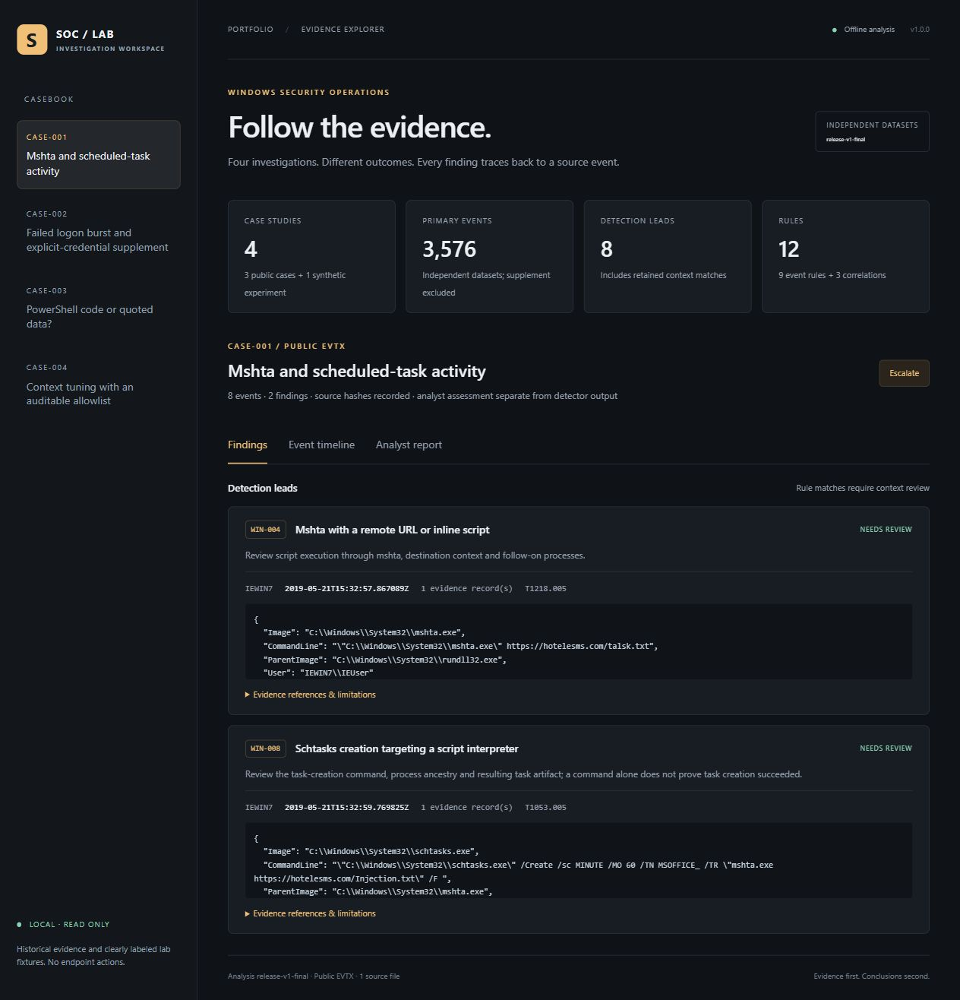
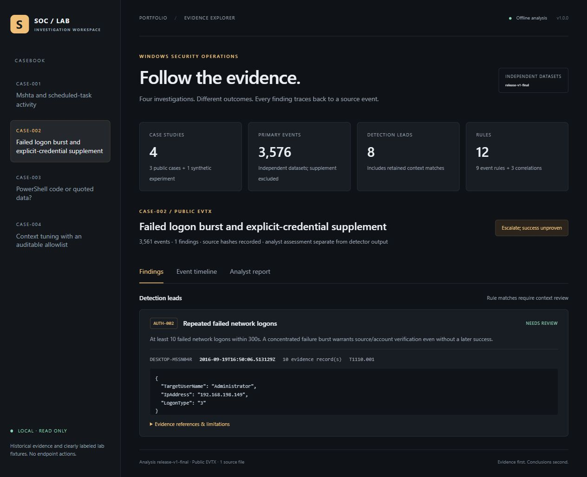
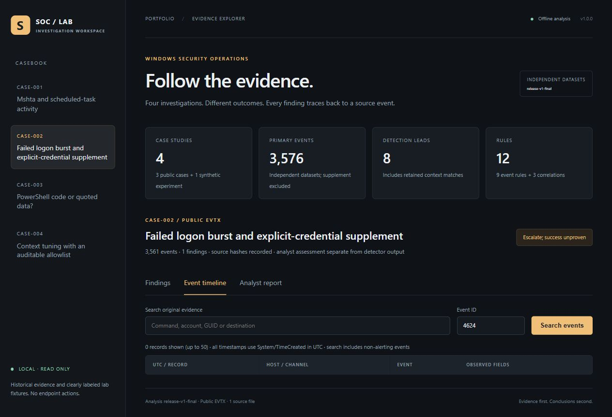
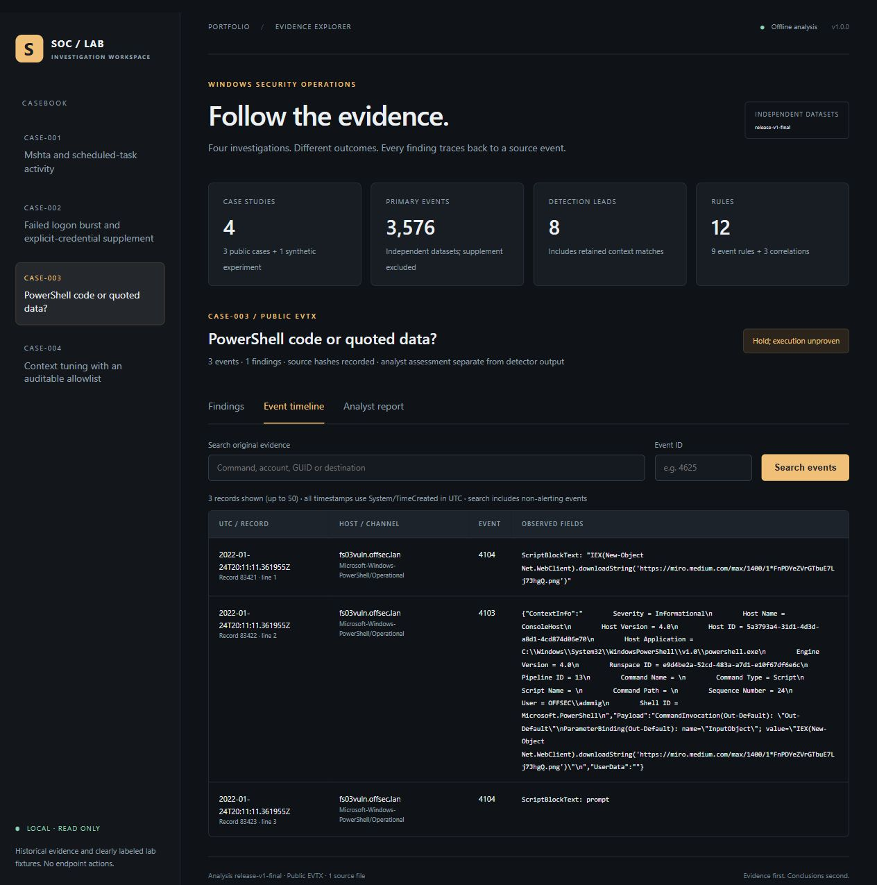
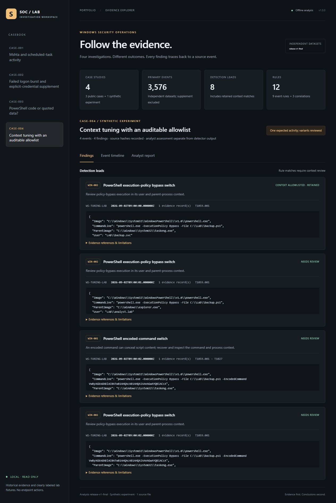

# Evidence gallery

These are genuine browser screenshots of the local case explorer after the underlying SQLite and detection bundles were produced. They were captured on 2026-10-04 with run release-v1-final. They are not images of a commercial SIEM, an EDR console or a production SOC. The fourth case is clearly labeled as a synthetic experiment.

Screenshots help a reviewer see the workflow. The stronger checks are the pinned EVTX hashes, record references, replay script, tests and machine-readable validation files.

## Process and task leads

## Failed network logons

The following search returns zero 4624 events in the supplied collection. It does not prove no successful logon occurred outside this export.

## PowerShell syntax and neighboring evidence

## Context annotation, with findings retained

## Structured evidence

- portfolio-validation.json: counts, source hashes and executable query checks.
- benchmark.json: three isolated worker runs and measured peak working set.
- sigma-validation.json: actual pySigma parse results.
- auth-summary.json, mshta-query.json, powershell-query.json: executed SQLite pivots.
- literal-check.txt: safe PowerShell syntax experiment output.
- test-results.txt: regression runner output.
- checksums.json: SHA-256 for the published evidence files and screenshots.

Raw third-party EVTX files remain local and are downloaded from pinned sources. These curated outputs contain historical public/sample identities; no personal-machine event logs or credentials are included.
