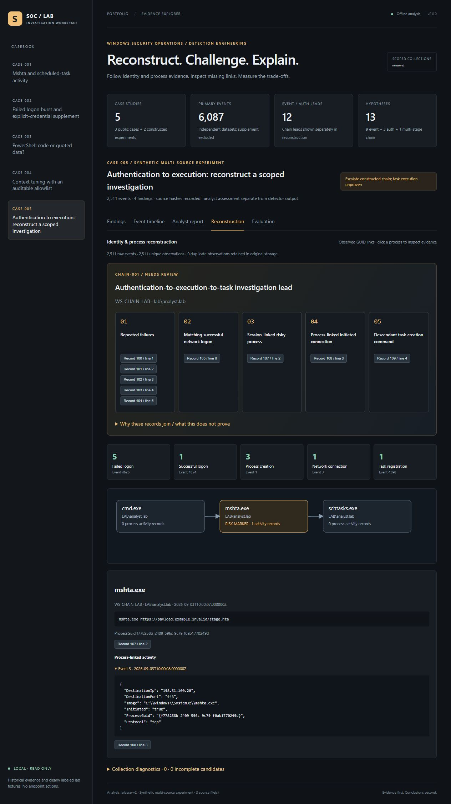
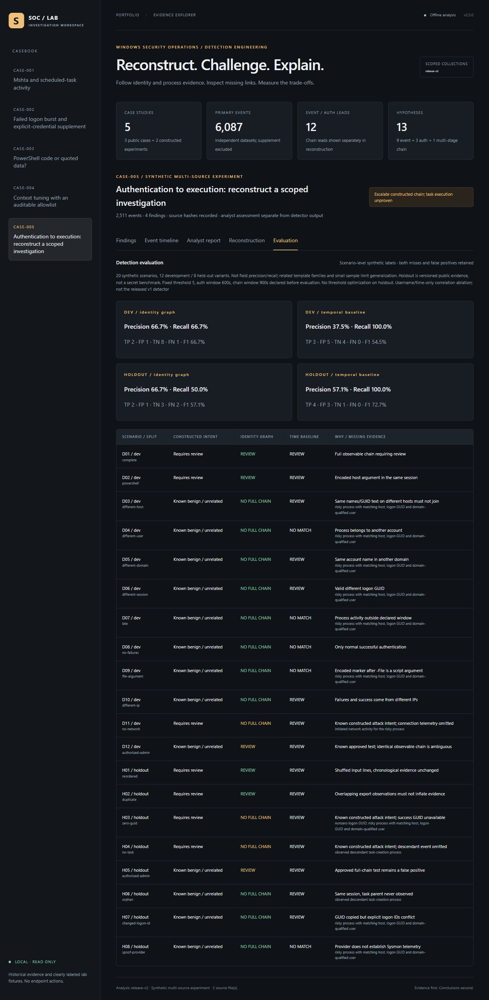
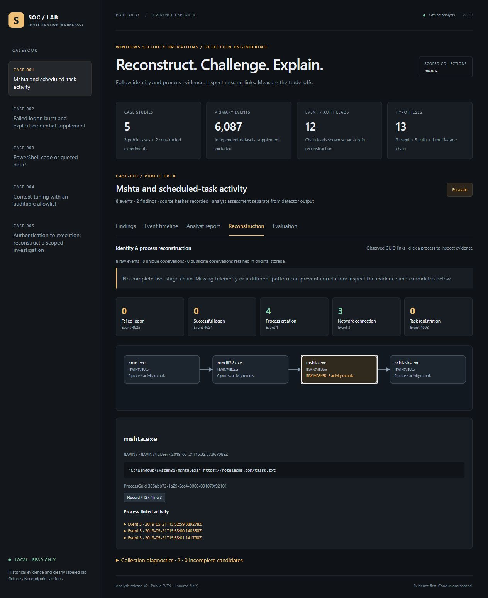

# Version 2 evidence gallery

These are genuine screenshots of the working localhost explorer, not renders of a simulated commercial SIEM. Case 005 is labeled as a synthetic multi-source experiment. Public case 001 uses the pinned EVTX collection from the original casebook.

## Multi-source investigation and process evidence

## All evaluation outcomes, including errors

## Graph from public EVTX evidence

## Machine-readable artifacts

- public-process-graph.json and chain-investigation.json: complete published reconstruction snapshots with stage references and join explanations.
- evaluation.json: source hashes, corpus/engine fingerprints, per-scenario outcomes and both development/holdout confusion matrices.
- replay-validation.json: expected collection counts and topology from the actual build.
- benchmark.json: three fresh processes loading and reconstructing the 2,511-event generated collection; maximum worker peak working set 28.83 MiB and median loading/reconstruction 0.048 seconds on this workload, not total laptop/browser memory.
- test-results.txt: actual regression runner output.
- ci-validation.json: remote validation results, added after the release run completes.

The 20 isolated corpus files, intent labels and checksummed inventory live in data/corpus. They are inert fixtures; no attack commands were executed. Related templates and public held-out labels limit the evaluation's generality. Original public EVTX remains a pinned local download. The root evidence/checksums.json inventories the published snapshots.
