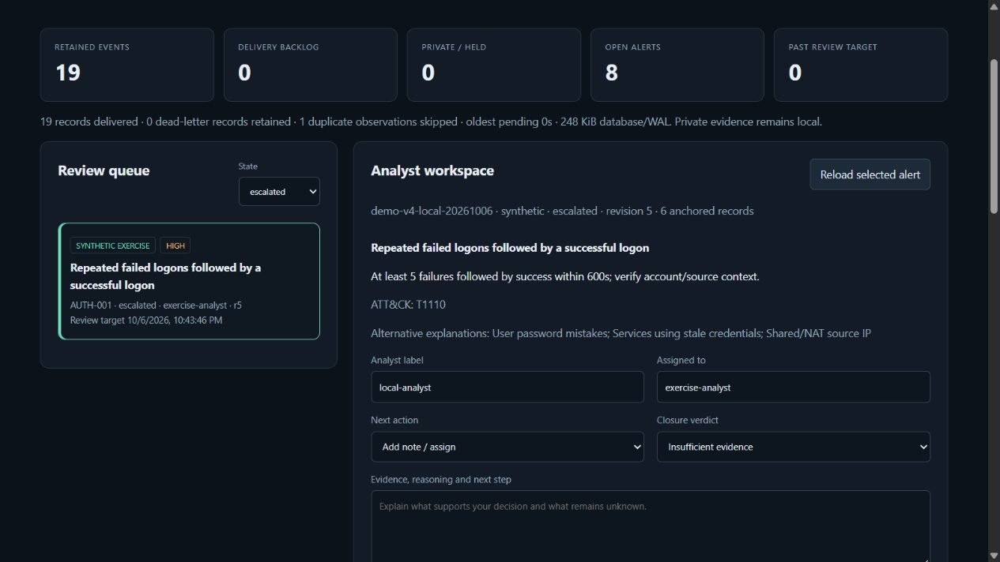
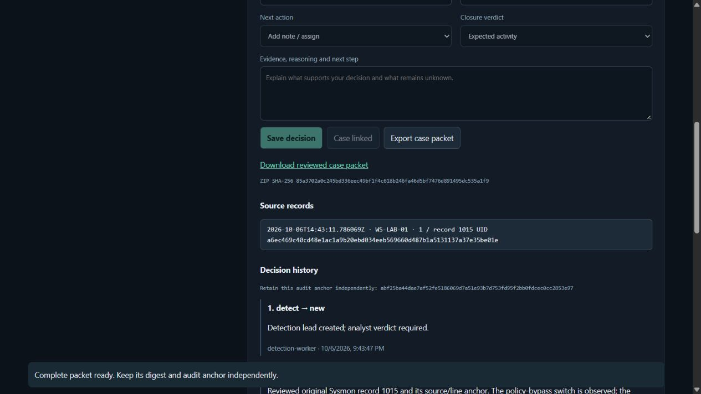
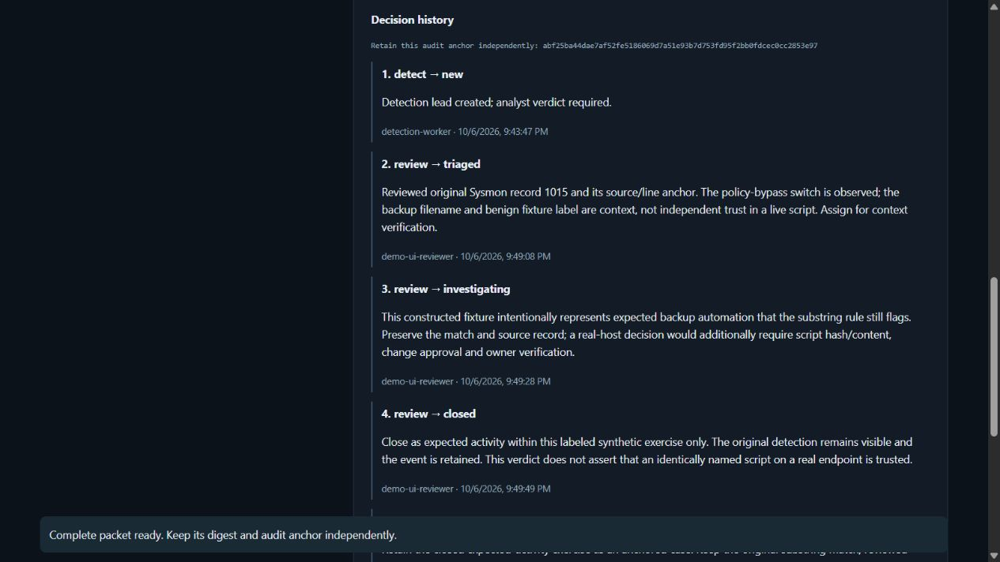

# v4 operational evidence

The [engineering design](../../docs/ENGINEERING_V4.md) and [runbook](../../docs/RUNBOOK_V4.md) explain what was implemented and its deployment boundary. These artifacts distinguish native private collection from constructed operational exercises.

| Artifact | Executed scope |
| --- | --- |
| [Backend validation](backend-validation.json) | Two-batch ingestion, 19 constructed records/eight leads, a real local HTTP 503 server, fresh-process queue check, snapshot/restore and actual Loki UID results |
| [Private collection proof](private-collection-proof.json) | Aggregate-only native incremental collection: 60 records with original XML, across System and PowerShell Operational; all held locally |
| [Browser validation](browser-validation.json) | Actual source inspection, assignment, triage/investigation/closure, case export, download digest and reload |
| [Local test output](test-results.txt) | Full suites on Python 3.11 and 3.12 |
| [Test metadata](test-validation.json) | Interpreter versions, test counts and exit codes |

## Operations console

The browser exercise uses `output/live/v4-local-20261006`, a separate constructed run from the final backend verification. It retains the event identities and explicit synthetic labels. Casebook/forensic work from the earlier releases remains available separately.

Actual raw host records, private matched script text, local credentials and host/account names are excluded from this folder. Native matches are unreviewed leads, not proof of malicious execution.

## Retained false-positive decision and packet

The expected-activity verdict applies to the labeled constructed backup exercise. It does not authenticate an identically named script on a real endpoint. Screenshots are unedited browser captures.
