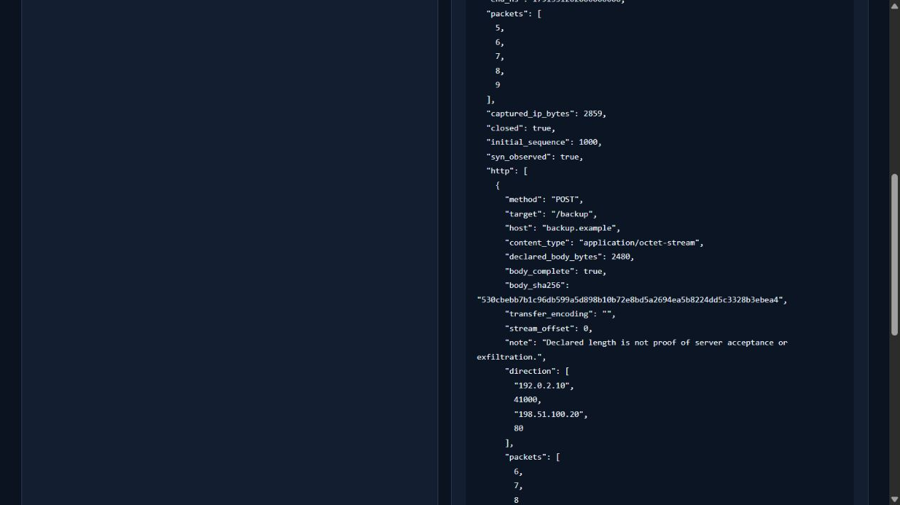
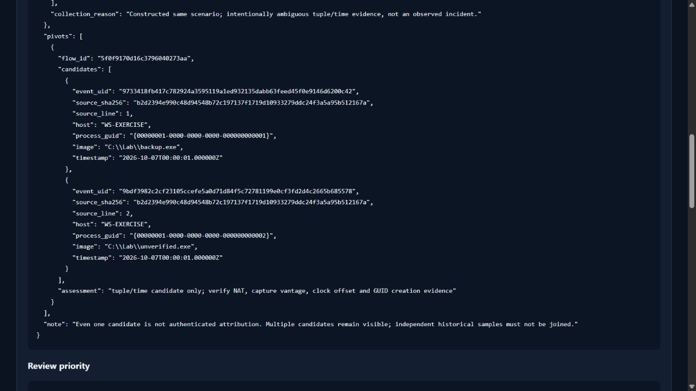
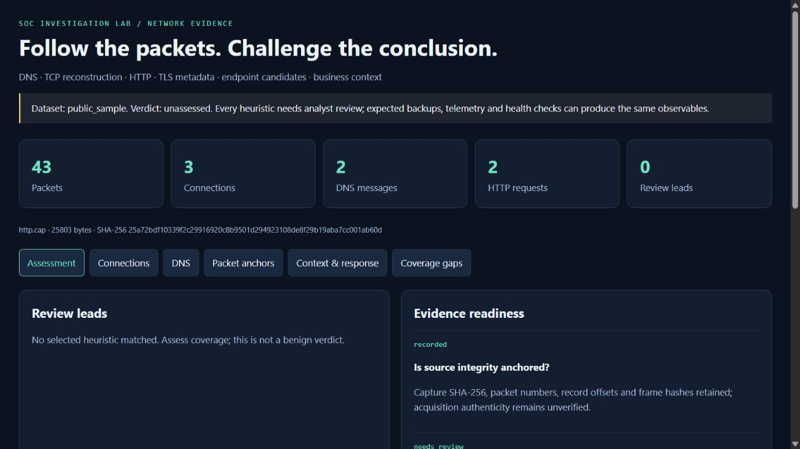

# Executed network investigation evidence

The v5 extension combines offline packet analysis, exact source-approved endpoint candidates and supplied business context. See [design/limits](../../docs/ENGINEERING_V5.md), [runbook](../../docs/RUNBOOK_V5.md), [public protocol case](../../cases/006-public-network/report.md) and [constructed ambiguity case](../../cases/007-network-context/report.md).

| Artifact | What was executed |
| --- | --- |
| [Network validation](validation.json) | Two pinned public captures plus 17 inert constructed packets; TCP reordering/retransmission; three review leads; two endpoint candidates retained; original-frame extraction; independent dpkt checks |
| [Test validation](test-validation.json) | Interpreter versions, full regression counts and source hashes |
| [Test output](test-results.txt) | Full Python 3.11/3.12 suites, including 27 new network regressions |
| [Fresh capture downloads](download-validation.json) | Exact official HTTPS Wiki-to-GitLab upload redirects, size/hash verification and the repaired initial CI failure |
| [Browser validation](browser-validation.json) | Actual local browser filtering, connection inspection, business-context/ambiguity inspection and packet-anchor selection |
| [Live regression](live-regression.json) | Fresh HTTP 503/fresh-process queue check and actual pinned Loki recovery of all 19 synthetic UIDs |
| [Legacy regression](legacy-validation.json) | Fresh EVTX, graph, 48 hunts, static AST and analyst case/export checks |
| [CI steps](ci-validation.json) | Seven passing jobs; downloaded logs confirm 127 tests in each Windows/Linux matrix job |
| [Downloaded artifact checks](ci-artifact-validation.json) | GitHub ZIP digests, exact inventories, tested Git source hashes, selected protocol fields and actual Loki results |
| [CI network response](ci-network-responses.json) | Independent decoding of both pinned public captures and the constructed exercise |
| [CI historical Loki response](ci-backend-responses.json) | Five historical counts/UID pivots and eleven dashboard records |
| [CI operational Loki response](ci-live-responses.json) | Nineteen unique UIDs after actual HTTP outage and fresh-process recovery |
| [Release verification](release-validation.json) | Tested tag target, uploaded/downloaded exercise ZIP and internal 21-file manifest |

## Genuine browser captures

These are unedited captures of the generated report. Scrolled detail views show the request and ambiguity; they are not screenshots of a commercial SIEM or a real compromise. The actual public HTTP/DNS captures were independently decoded without contacting their captured domains. No private capture, endpoint logs, credentials, response action or original third-party PCAP is published here.

