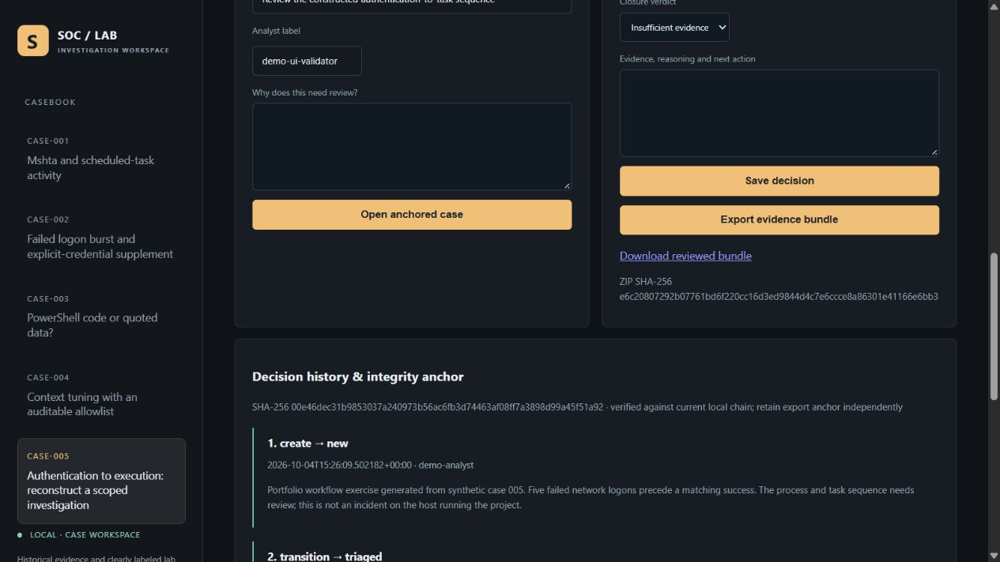
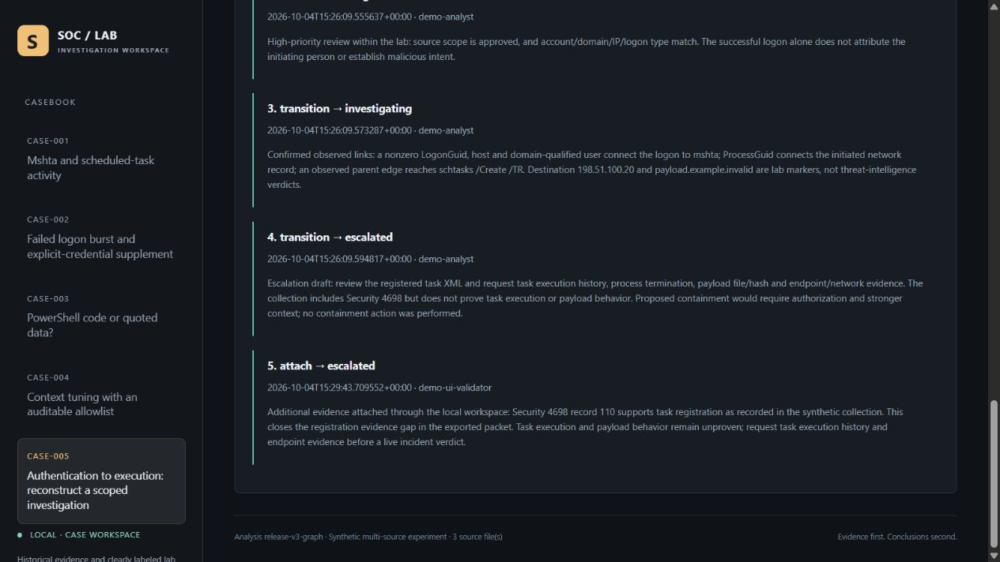
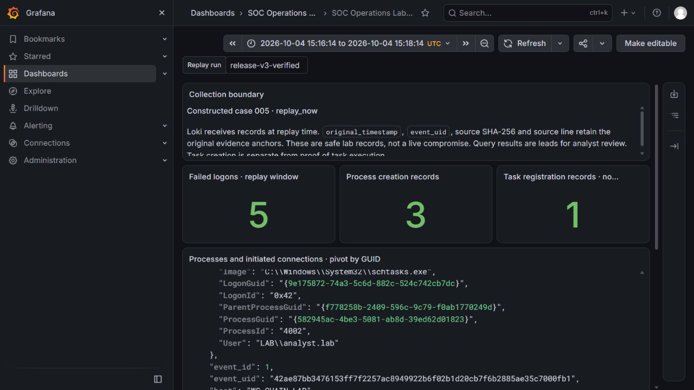

# Version 3: executed operations and backend evidence

These artifacts were produced on 2026-10-04. Public EVTX, inert constructed records and a separate private read-only collection have distinct source boundaries. Codex assisted development and initial reviews. No endpoint attack or containment action was performed.

## Case workspace

The browser exercise uses constructed case 005. `build_operations.py` creates four initial decisions and nine chain anchors. The interface then attached Security 4698 record 110 with an explicit reason, producing revision 5, ten anchors and a new exclusive export. Actor labels describe the exercise; they do not authenticate a person.

[workflow-validation.json](workflow-validation.json) records the ZIP digest and audit anchor. [The reviewed packet](reviewed-bundle/report.md) is its verified unpacked content; the ZIP stays local. Its manifest checks the files. A database owner can rewrite and reseal history, so these hashes are relative integrity against retained anchors, not digital signatures.

## Actual Loki and Grafana

[backend-validation.json](backend-validation.json) retains actual Loki 3.7.8 responses: five independent historical counts of 8, 3,561, 3, 4 and 2,511, a UID/source-hash pivot and eleven meaningful case-005 records replayed at arrival time. Original timestamps remain in JSON. `release-v3-verified` selects this experiment; exact replay bounds are recorded. The dashboard uses an absolute UTC range. These records did not arrive continuously from a live endpoint.

[grafana-validation.json](grafana-validation.json) records Grafana 13.2.3 database health, Loki datasource health, six provisioned panels and browser-observed values 5/3/1. The images are unedited viewport captures of the actual local applications.

[resource-profile.json](resource-profile.json) includes Loki, Grafana and its Loki helper: 151.41 MiB combined working set at that snapshot. It excludes browser/OS memory; individual peaks were not simultaneous. It is not a memory ceiling. Unused bundled datasource plugins were disabled in this fresh lab profile.

## Hunts, forensics and engineering

- [hunts.json](hunts.json): eight read-only SQL hypotheses across five cases and the independent credential supplement, 48 executions. Empty results describe scope, not a benign verdict.
- [forensics.json](forensics.json) and [AST evidence](ast/public-quoted.ast.json): complete/gapped/conflicting script fragments, bounded decode and parse-only inspection. The public quoted expression has zero command/member-invocation nodes on both PowerShell 7.6.5 and Windows PowerShell 5.1.26100.9444.
- [test-results.txt](test-results.txt): 75 passing tests on each local Python interpreter, 3.11.5 and 3.12.11; includes source-preserving reads, Windows sharing retry, HTTP boundaries, stale decisions, audit/state changes and exclusive export integrity.
- [indexing-benchmark.json](indexing-benchmark.json): three fresh workers each for released v2 and v3, 1,200 auth records/200 candidates, identical result digests. The improvement is specific to this constructed workload.
- [local-collector-validation.json](local-collector-validation.json): 20 existing System records privately collected/imported with original XML. Only counts and hashes are public. This validates acquisition, not attack detection.

The [historical v2 gallery](../advanced/README.md) retains the held-out errors and the baseline's higher F1. Use [the runbook](../../docs/RUNBOOK_V3.md) to reproduce current work and [the validation record](../../docs/VALIDATION.md) for CI status. The root checksum inventory covers these artifacts. A source hash identifies received bytes, not source authenticity.
