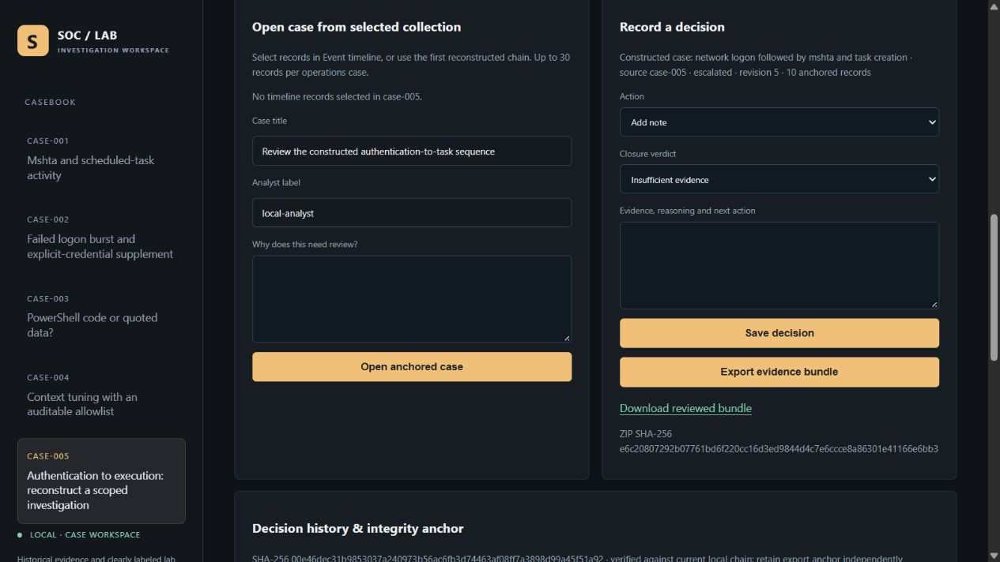
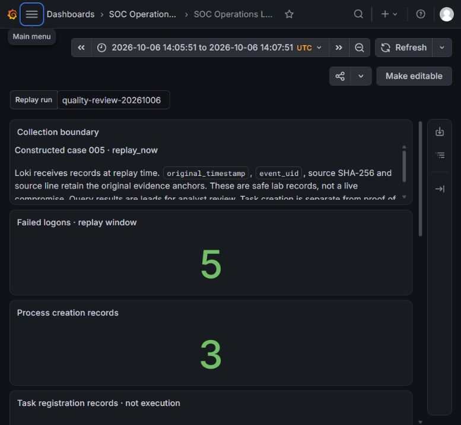
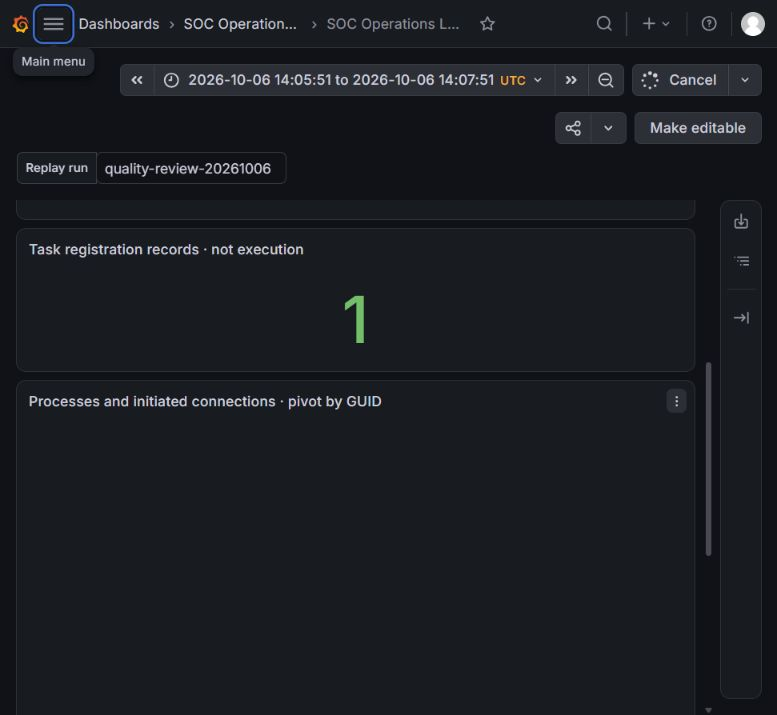

# v3.0.1 review evidence — 6 October 2026

This folder records a fresh adversarial review and replay. The [review report](../../docs/QUALITY_REVIEW.md) connects each failure to its repair and test. Earlier `evidence/operations` artifacts remain the historical v3.0.0 snapshot.

| Artifact | Scope |
| --- | --- |
| [Validation metadata](validation.json) | Six tests before fixes: five failures/one error; final 84-test suites on two local interpreters; fresh collection and hunt counts |
| [Test output](test-results.txt) | Actual full-suite subprocess output |
| [Runtime failure](runtime-failure.json) | Real Loki launch followed by an injected Grafana launch failure; owned-process cleanup |
| [Backend responses](backend-validation.json) | Actual local Loki historical counts, source/UID pivots and replay-now queries |
| [Browser validation](browser-validation.json) | Reload and actual ZIP download; digest identical to the retained synthetic revision-5 packet |
| [Resource snapshot](resource-profile.json) | Three managed backend processes: 163.11 MiB working set; excludes browser/OS and is not a ceiling |
| [Indexing measurement](indexing-benchmark.json) | Three fresh workers per version, identical outputs; workload-specific 24.2× median ratio |

## Existing reviewed packet restored after reload

The browser downloaded the actual ZIP. It matched the earlier release packet byte for byte. No new incident decision or endpoint action was manufactured for this screenshot.

## Native Grafana querying the fresh replay

The selected run is `quality-review-20261006`. The visible source boundary identifies constructed evidence; the three counters are 5, 3 and 1. Historical source timestamps stay in the JSON while the dashboard uses replay-time timestamps.

Screenshots are genuine browser captures without compositing. Public and constructed lab evidence may be published; private local System records and runtime credentials are excluded.
